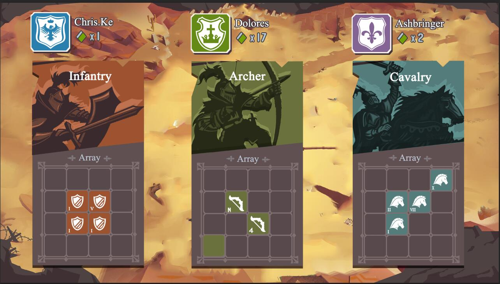

# 首款开放逻辑游戏《卡莱战纪》


让我们来看看小张和大李在卡牌游戏《卡莱战纪》里的玩家体验（方括号里是机制解释）：

小张的两张骑兵卡正在挂机战役“安息训练营”里缓慢刷分。小张没空为它们找更合适的战场，因为他正在寻找一张T形卡来完善他在回合制战役“两河决战”里的阵型。[<u>卡牌资源自由分配参与到不同战役里，战役可以有不同玩法</u>]

他在商店里发现一张非常合适的2级T形步兵，可价格高达9.9GAS！步兵疯狂涨价是因为多人协作战役"凯撒之光"被爆合约算法有利步兵，而优化版本还需三天上线。[<u>卡牌资源自由交易，价格会受游戏里各种因素影响</u>]

这种现象卡莱官方无法干涉，因为官方把逻辑通过根合约写死在区块链上：对第三方战役只限制战利回馈，不限制玩法。[<u>**开放接受第三方玩法任意接入。官方根合约只限制每次战役收益**</u>]

小张非常需要这张牌来赢得“两河决战”，这样他才有足够分数合成一张9级卡以够格参与“克拉苏信使”的限时返利活动。[<u>子玩法不对卡牌或其属性做任何变更，只在结束时告诉根合约各参战牌的得分百分比。根合约根据此百分比为各卡牌加分。玩家在根合约里进行卡牌冶炼和交易，每张牌的得分将影响冶炼结果。</u>]

小张如此向往的“克拉苏信使”是以画面精美著称的第一人称动作战役，玩家扮演的兵种和隐藏剧情都由参与战役的卡片类型和形状决定。“克拉苏信使”还是卡莱战纪里第二个主逻辑及战果分配均由运营方而非智能合约生成的传统中心化玩法。[<u>子玩法形式自由。不一定是去中心化游戏。只要开发方实现接口智能合约实现报名和结算两个过程，并在规定截止时间前把战力分配结果写回链上即可。</u>]

“克拉苏的信使”的开发者对区块链其实还只是一知半解，但是卡莱的平台使他们无需具备太多知识，顺着教程他们只花了不到半周时间进行讨论和接口合约配置，就把自己拿手的中心化游戏体验植入了进来，获得了卡莱战纪里几百万玩家。区块历史显示他们靠玩家参与提成已经赚到接近1百万个GAS了。[<u>**极大降低开发者区块链游戏门槛；新的开发者盈利方式(有人来玩就分成)**</u>]

大李则对小张这样紧绷的神经不以为然。他那5张10几级的骑兵卡每天干的事就是参加一个拿纳斯达克指数当随机数的赛马战役，点一下就能看结果。还不比小张赚的少。[<u>同时对硬核玩家、投资者和投机者友好。</u>]

大李从不担心运营方跑路。因为虽然那个赛马是依赖中心服务器的，但玩家所拥有的卡片永不会因为参战丢失，最大损失无非是一次参与费和一些结算分数。[<u>若是接口协议有漏洞或开发方出毛病，负面影响无非是本次战役的战利品分配不公。这种事件会让该玩法丧失玩家参与热情。</u>]

若是发生问题，大李就会到论坛上去搜寻另一个适合他风格的玩法。卡莱战纪里已有上百种战役玩法，并且每天都还在新增中。[<u>若是接口协议有漏洞或开发方出毛病，负面影响无非是本次战役的战利品分配不公。这种事件会让玩家更倾向于把资源投入到其他玩法中去。</u>]

...

以上场面描述的是《卡莱战纪》这款区块链游戏的愿景。从模拟人生，侠盗飞车到Minecraft, 开放世界里玩家看似摆脱了设计者的剧本束缚可以自由行动，可他们仍在设计者建造的沙盒世界中。Mod游戏可以一定程度，区块链技术则为我们提供这样一种可能：**假如玩家不喜欢这个玩法，那么就换一个，同时无需将之前努力归零**。《卡莱战纪》将是对这种理念的第一次尝试。

作为一款卡牌游戏，《卡莱战纪》的基础设计很直接：基本资源是代表不同兵种的4x4格子卡牌，每个格子有不同的等级。玩家将若干卡牌投入一场战斗并在结算后瓜分分数奖励，这个分数将影响卡牌合并时新卡牌的品质。此外卡牌也可以在商店里自由交易。




现在重点来了：战斗如何进行，如何决定胜负？胜利者们如何分配奖励？我们把这部分开放给插件协约开发者们。如果把《卡莱战纪》主体比做运营一家电影院，那么每个厅里都在放映一部第插件协约开发者制作的电影。

基础卡牌的二维性、等级和兵种为插件协约设计提供了足够大的策略纵深空间：

插件协约可以是纯粹去中心化智能协议代码，也可以仅仅是某传统中心化游戏的报名表；可以根据某动态原则在一幅地图上实现兵种的生克(黎巴嫩山脉或两河平原)，也可以更强调多张卡片间的布阵与平衡；可以广泛引入随机性吸引赌徒，也可以排除任何随机因素如同象棋般吸引技术玩家；插件开发者甚至可以开发自己的专用客户端来表现自己独特的战斗过程来吸引玩家。


实现插件协约在技术上实质是制定一组动态调用的函数(见文末伪代码)作为智能合约接口。有兴趣为《卡莱战纪》开发插件的开发者们只要遵循这个接口，就能自主设计专门实现战斗功能的插件智能协约。


卡莱战役的主


```C#
/** CarryBattle War Plugin Contract Interface (Peudocode)
*
* Notes:
* 1. The types of the parameters may vary in response of the restrictions of different chains. This is the Peudocode for reference.
* 2. The source contract has already done the validation work of the input parameters such as card ownership and availablity. The plugin can focus on logic realization.

* 卡莱战纪插件战斗智能合约接口(伪代码)
* 注意：
* 1. 参数类型会根据不同主链限制做调整。此处只是做参考的伪码。
* 2. 母合约已经对输入参数进行合法检测，诸如卡牌所有权与可用性。插件可以集中在自身逻辑实践上。
*/


interface CBWar: SmartContract{
    
    /** Does it allow a player with a particular set of cards to create a war?
    * 是否允许一个玩家及一组牌创建战斗
    * @param playerID: the playerID applying to create the war.
    * @param cardIDs: the array of the cards to create a war.
    * @param extra: extra parameters
    * @return: The blockchain height of finalization. If the return value is equal or less than the required minimal value, it means the creation is invalid.
    */
    public BigInteger AllowCreate(BigInteger playerID, BigInteger[] cardIDs, byte[] extra){}
    
    
    /** Use a player with a particular set of cards to create a war?
    * 使用一个玩家及一组牌创建战斗
    * @param playerID: the playerID applying to create the war.
    * @param cardIDs: the array of the cards to create a war.
    * @param warID: the warID allocated by the source contract. 
    * @param extra: extra parameters
    * @return: The blockchain height of finalization. If the return value is equal or less than the required minimal value, the warID would be recycled.
    */
    public BigInteger Create(BigInteger playerID, BigInteger[] cardIDs, BigInteger warID, byte[] extra){}
    
    
    /** Does it allow a player with a particular set of cards to join the war?
    * 是否允许一个玩家及一组牌加入战斗
    * @param playerID: the playerID applying to join the war.
    * @param cardIDs: the array of the cards to join a war.
    * @param warID: the warID allocated by the source contract. 
    * @param extra: extra parameters
    * @return: If the return value is -1, the player cannot join the war. Else return the order of the player in this war.
    */
    public BigInteger AllowJoin(BigInteger playerID, BigInteger[] cardIDs, BigInteger warID, byte[] extra){}  
    
    
    /** Use a player with a particular set of cards to join the war
    * 使用一个玩家及一组牌加入战斗
    * @param playerID: the playerID applying to join the war.
    * @param cardIDs: the array of the cards to join a war.
    * @param warID: the warID allocated by the source contract. 
    * @param extra: extra parameters
    * @return: If the return value is -1, the player cannot join the war. Else return the order of the player in this war.
    */
    public BigInteger Join(BigInteger playerID, BigInteger[] cardIDs, BigInteger warID, byte[] extra){}
    
    
    /** Does it allow a player with a particular set of cards to retreat from the war?
    * 是否允许一个玩家及一组牌加入战斗
    * @param playerID: the playerID applying to join the war.
    * @param cardIDs: the array of the cards to join a war.
    * @param warID: the warID allocated by the source contract. 
    * @param extra: extra parameters
    * @return: Allow or not. Failure may due to a lot of reasons. Plugin should 
    */
    public Boolean AllowRetreat(BigInteger playerID, BigInteger[] cardIDs, BigInteger warID, byte[] extra){}  
    
    
    /** Use a player with a particular set of cards to join the war
    * 使用一个玩家及一组牌加入战斗
    * @param playerID: the playerID applying to join the war.
    * @param cardIDs: the array of the cards to join a war.
    * @param warID: the warID allocated by the source contract. 
    * @param extra: extra parameters
    * @return: Success or not.
    */
    public Boolean Retreat(BigInteger playerID, BigInteger[] cardIDs, BigInteger warID, byte[] extra){}
    
    
    /** The result of a war.
    * @param playerID: the playerID applying to join the war.
    * @param cards: the array of the cards to join a war.
    * @param warID: the warID allocated by the source contract. 
    * @return: The percentage of the award with the order of the players and cards. If the value of a byte exceeds 99 or the sum reaches equal or greater than 100, the related card would take all the left percentage, and the rest of cards would receive 0.
    */
    public byte[] Finalize(BigInteger warID){}
    
    /** The address for the plugin developer to receive the royalty*/
    public Address GetRoyaltyOwner(){}
    
    /** The royalty rate. With a decimal TBD*/
    public BigInteger GetRoyaltyRate(){}
    
    
}
```


