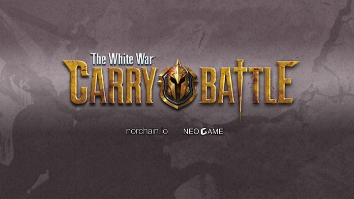

# 《卡莱战纪》：假如你是拜占庭将军

> 公元前53年早春，古老的两河平原漫天风雪，峰火遍燃。卡尤斯的大帐里摆着分别来自罗马第一军团三营营长克罗蒂，第三军团旁修纳，以及亚美尼亚将军艾西农斯的信函，内容大致都是“巴比伦城防务空虚，速出兵，三日后城下会攻“。亚美尼亚人矫揉谄媚的文字并没能让卡尤斯失去理性——这位罗马将军正陷入极度矛盾的痛苦中。
>
> 尽管机会极佳，信看上去也都是真的，四军合围更是胜算十足，卡尤斯还是断定出兵风险太大。近来亚美尼亚人行动非常可疑，如果他们趁此机会倒戈，罗马五个营的精锐面对强大而残忍的波斯守军及叛军，下场就只有尸骨无存。但即便如此，卡尤斯也无法拒绝邀约。理由很简单：时间太短，他没有能力把劝阻的信件在会战开始前送达所有人。如果在亚美尼亚人最终并没有叛变，而战斗因为他的缺席蒙受巨大损失，那么他就成了叛徒。执政官克拉苏一直怀疑他是庞培党，两日前还曾来信训斥他进军不力，言辞极尽苛责。一旦这种把柄被他抓到，这个驰骋疆场三十载的老兵怕是末日也不远了。
>
> 去，是扎进胸口的弯刀；不去，是处决叛徒的绞架…… 更可怕的是，无论最终如何决策，他都必须在几个小时内作出反应。因为如果决定要去，必须今晚出发才可能及时赶到巴比伦。
>
> 该怎么办？一片雪花粘在卡尤斯稀疏的胡渣上，又瞬间融化到他那呆滞若石像的身躯里。
>
> 帐檐下的积雪被篝火的温度融化，嘀嗒、嘀嗒，摔在破旧的羊毛毯上。罗马军主力数日前离开叙利亚移师到卡莱附近，会战一触即发。克拉苏数年前成功镇压了斯巴达克斯的奴隶起义，现在心心念着的只有打败波斯人，这样能让他在元老院那里的风头盖过正在向西扫荡凯尔特人的战神凯撒。傲慢而贪婪让他完全不及顾暇此役之险，罗马的重步兵部队穷追着波斯骑兵长途奔袭疲敝至极，铁履在雪地划上的踉跄脚印深深浅浅，横七竖八如同亚维农巫师的摄魂符。
>
> 嘀嗒、嘀嗒，羊毛毯上晕开一层层水渍，那是死神的沙漏。大帐里的潮腐味和着空气中的冰渣吸入鼻子，隐隐刺痛。东方已渐白，厚厚的阴云被大风狂撵着，在冰封的幼发拉底河上飞快的掠过倒影，这无尽旷野里唯一的静动。
>
> "父亲大人，不如....." 一个年轻的声音打破了沉默。
>
> 
>
> —— 帕提亚人史 奥特耶洛纪 卷三

上篇讲述的是改变人类历史20大战役之一：卡莱战役里的片段，也展现了一个典型的拜占庭将军问题。假如你是拜占庭将军，该如何在有限的通信条件和共识方法下辨别真伪敌友，用最佳的分配调度来达到目的？大家都知道这个难题在今天有区块链技术解决，但在两千年前历史背景下，将军们的一切决断都必须基于超人的嗅觉、判断力和勇气。

##  玩法概要

**《卡莱战纪》是一款模拟拜占庭将军问题的卡牌链游，在共识网络上第一次尝试重现那个难以共识的时代**。玩家将在宏大的古欧亚大陆历史背景中扮演独立决策的将军，分配手中的卡牌军队发动或参与攻城战。不同于普通组队PvP游戏，虽然宣战时各方都必须声称自己隶属攻方或守方，但只有在兵临城下时大家才会亮牌知道会战的各方谁是真的盟友，谁是内奸或叛徒。

对其他玩家的行为判断当然不是无据可循。作为一款全逻辑上链游戏，所有玩家的参战历史都公开可查，谁是见利忘义的墙头草，谁是最有信誉的坚定战士，谁和谁明显每次都在线下商量好了暗地协作，谁是最狡猾的局势洞察者，都可以通过参考链上数据进行判断和预测。玩家也因此逐渐形成自己的群落，更多的和自己喜欢的人会战，发展出不同的敌友分析及游戏策略来。

详细玩法说明请移步[玩法介绍](https://github.com/norchain/NEOGameComp/blob/master/%E5%8D%A1%E8%8E%B1%E6%88%98%E7%BA%AA-%E7%8E%A9%E6%B3%95.md)。

## 技术概要

在《卡莱战纪》研发过程中，我们开源了项目[Neunity](https://github.com/norchain/Neunity) ，旨在提高NEO智能合约开发效率。Neunity主要内容包括：NEO智能合约本地离线断点调试及测试用例、C#客户端直接复用合约逻辑、仿HTTP智能合约通信协议Neunity Transfer Protocol(NuTP)、高灵活度序列化方案及类型描述规范NuSD、类URI的Storage管理方案NuIO等。Neunity自开源半月来获得社区关注，也帮助一些参赛队伍改进智能合约研发流程及内容。下一步希望能加深与NEL，NEO-Lux及NeoCompiler的合作，成为促进NEO生态发展的一环。

详细技术特点说明请见：

## 相关资源

首支[宣传视频](https://youtu.be/PdRJCIeihiY):

试玩地址: [海外](http://www.norchain.io/neounity)  [中国大陆](http://119.23.254.156/neounity/)

即时通信社区: [Discord](<https://discord.gg/pKQyyrP> )

Twitter: https://twitter.com/carry_battle

Email: info.carrybattle@gmail.com

开发者主页：[norchain.io](norchain.io)

开发者邮箱：rct1985@qq.com

## 感谢

十分感谢[NEL](https://github.com/NewEconoLab)及BlaCat对活动的资助及技术支持，感谢[neo.game](neo.game)组织者Gene及其他朋友的辛勤劳动。

感谢NeoResearch的[igormcoelho](https://github.com/igormcoelho)，[FabioRick](https://github.com/FabioRick) 及[vncoelho](https://github.com/vncoelho) 提供[neocompiler.io](https://neocompiler.io/) 这样好用的在线私链工具。

感谢[Neo-lux](https://github.com/CityOfZion/neo-lux)的[Relfos](https://github.com/Relfos) 提供Unity中RPC接口。

感谢参赛游戏[FabioRick](https://github.com/FabioRick) (也是neocompiler开发者)与我彻夜讨论各种NEO细节问题，以及区块内多随机数算法方案。

感谢参赛游戏[BigRedLottery](https://github.com/generalkim00/neogame)的作者[generalkim00](https://github.com/generalkim00) 及[maxpown3r](https://github.com/maxpown3r) 分享无敌经典的绝无争议跨区块随机算法（该算法同时应用到BigRedLottery和CarryBattle里，在技术篇里我会详细描述）。

感谢参赛游戏[CarveLoveonBlockchain](https://github.com/exclusivesunil/howmuchyaknowabotme) 的作者[gongxiaojing0825](https://github.com/gongxiaojing0825)及[exclusivesunil](https://github.com/exclusivesunil) 为Neunity提供Mac上的编译脚本。
