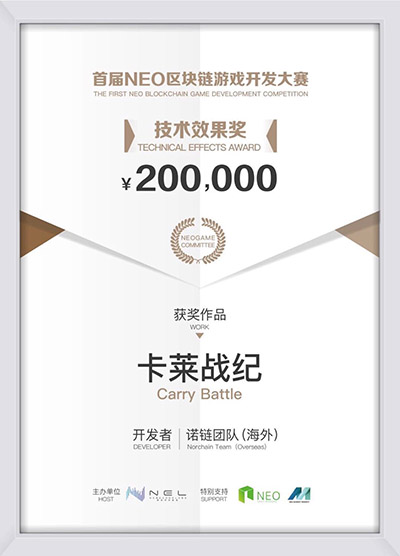
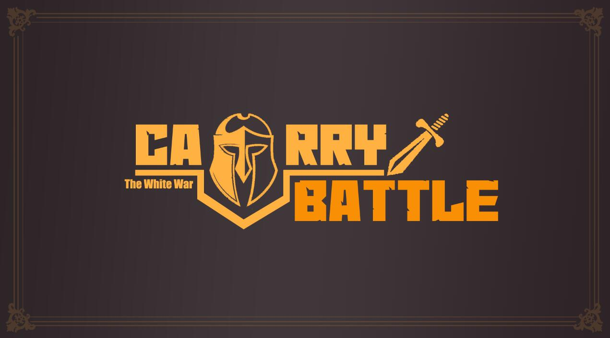

# 《卡莱战纪》：假如你是拜占庭将军

 **卡莱战纪**获得NEO第一届区块链游戏开发大赛“技术效果奖”。

试玩地址: [海外](http://www.norchain.io/neounity)  [中国大陆](http://119.23.254.156/neounity/)

> 公元前后的欧亚大陆，罗马共和国与安息帝国在广袤的两河平原角逐，战火遍野。在名城卡莱附近胶着时，罗马人找到了极可能为他们取得胜利的机会：原来热爱音乐与诗的安息人民会选举出最优秀的吟游诗人在祭祀上吟诵反映时事的诗篇，如果诗篇的内容正好符合某种神秘的模式，某些地方或人物就会被上天降临的甘露或闪电带来丰收或灾难。罗马人准备通过各种途径选上自己安插的吟游诗人而增加战争胜利的筹码...

此篇概括叙述《卡莱战纪》的玩法和技术特点， 并鸣谢对项目有帮助的朋友。其他内容请参见：

[核心玩法:在拜占庭网络上模拟拜赞庭将军问题](https://github.com/norchain/NEOCarryBattle/blob/master/%E5%8D%A1%E8%8E%B1%E6%88%98%E7%BA%AA-%E6%A0%B8%E5%BF%83%E7%8E%A9%E6%B3%95.md)

[去中心化小说对世界影响](https://github.com/norchain/NEOCarryBattle/blob/master/%E5%8D%A1%E8%8E%B1%E6%88%98%E7%BA%AA-%E5%B0%8F%E8%AF%B4.md)

[软分服: 大规模链游解决方案](https://github.com/norchain/NEOCarryBattle/blob/master/%E5%8D%A1%E8%8E%B1%E6%88%98%E7%BA%AA-%E5%88%86%E6%9C%8D.md)

[技术: Neunity框架，非对称熵，以及其他](https://github.com/norchain/NEOCarryBattle/blob/master/%E5%8D%A1%E8%8E%B1%E6%88%98%E7%BA%AA-%E6%8A%80%E6%9C%AF.md)

##  玩法概要

**《卡莱战纪》是一款模拟拜占庭将军问题的卡牌链游，在共识网络上第一次尝试重现那个难以共识的时代**。玩家将在宏大的古欧亚大陆历史背景中扮演独立决策的将军，分配手中的卡牌军队发动或参与攻城战。

拜占庭将军问题背后的故事是：几个将军想协同攻城，必须有足够人共同参与才能成功，可是相互通信又不便。那么协同攻城的邀约是否可信？是否足够多盟友出兵？畏缩退兵是否会导致盟友的损失？在《卡莱战纪》里，你只有兵临城下时才能确知答案。

**《卡莱战纪》 还是第一款靠去中心化连载小说影响链上逻辑的链游**。每一章的周期里，各分服都可由玩家投票选出最佳章节并上链，作者将获得奖励并成为该阶段游戏世界里的特殊角色“吟游诗人”而影响该分服逻辑。你将在[这篇文章](https://github.com/norchain/NEOCarryBattle/blob/master/%E5%8D%A1%E8%8E%B1%E6%88%98%E7%BA%AA-%E5%B0%8F%E8%AF%B4.md)中了解到具体的设计将如何使得《卡莱战纪》成为一场考验人性的实验。另外卡莱战纪有宏大的全球性历史背景及新颖的写作题材空间，相信随着游戏进行会在某分服逐渐出现伟大的链上公投协作文学作品。

## 技术概要

### 1. 引擎层

借助在《卡莱战纪》的机会，我们开发并开源了项目[Neunity](https://github.com/norchain/Neunity) (MIT)，旨在提高NEO智能合约开发效率，以实现大规模上链逻辑的工程可实践性。Neunity目前实现的主要内容包括：

1. [完成]研发适配器以实现NEO智能合约本地离线断点调试及测试用例，以及C#客户端直接复用合约逻辑。[视频教程](https://youtu.be/vTkNzx403p8)
2. [完成]灵活的类型描述规范及自定义序列化方案[NuSD](https://github.com/norchain/Neunity/blob/master/NeunityBytesSeralization.md)。
3. [完成]仿HTTP合约通信协议Neunity Transfer Protocol([NuTP](https://github.com/norchain/Neunity/blob/master/Neunity/Neunity/Tools/NUTransferProtocol.cs))。
4. [完成]类URI的Storage管理方案[NuIO](https://github.com/norchain/Neunity/blob/master/NeunityStorageManagement.md)。

Neunity自开源半月来获得社区广泛关注和帮助，为Neunity或《卡莱战纪》贡献代码或创新解决方案的朋友包括：

1. [generalkim00](https://github.com/generalkim00) 及[maxpown3r](https://github.com/maxpown3r)：为带有竞争性的Dapp提供公平性、防拥堵及帮助记账者避嫌的“非对称熵(Asymmentropy)” 。[[原版原理说明](https://github.com/generalkim00/neogame)，[中文简介](https://github.com/norchain/NEOCarryBattle/blob/master/%E5%8D%A1%E8%8E%B1%E6%88%98%E7%BA%AA-%E6%8A%80%E6%9C%AF.md) (2.2节)]
2. [FabioRick](https://github.com/FabioRick) 及 [Jason L Perry](https://medium.com/@ambethia)：区块内多次获取随机数。并发表文章"[Random Number at Runtime](https://medium.com/@fabiohcardoso/random-number-at-runtime-neo-smartcontract-60c4e6cb0bb1)"
3. [gongxiaojing0825](https://github.com/gongxiaojing0825)及[exclusivesunil](https://github.com/exclusivesunil) ： 提供Mac上Neunity的连续集成自动化编译脚本

在此对他们表示深深感谢！

同时，十分高兴看到Neunity能帮助本次参赛一些队伍提速智能合约研发流程，这些项目包括（排名不分先后）：\#140 [NEOPixelBattle](https://github.com/NEOGaming/NEOGames/tree/master/NEOPixelBattle) ,\#78 [BigRedLottery](https://github.com/generalkim00/neogame), \#95 [CarveLoveonBlockchain](https://github.com/exclusivesunil/howmuchyaknowabotme), \#111 [Pirateo](https://github.com/leonhano/SeaExplorer), \#100 [FomoNEO](https://github.com/qw1985/FomoNEO), \#55 [Devourer](https://github.com/norchain/NEOGameDevourer), \#46 [CarryBattle](https://github.com/norchain/NEOCarryBattle)

Neunity同时在进一步集成NEO-Lux RPC，并在与neocompiler.io讨论建立API，以提供本地调试完毕后一键部署neocompiler.io进行测试的连续集成工具链。下一步也十分希望能加深与包括NEL和BlaCat的钱包在内的其他CoZ优质项目的合作，为促进NEO实践大规模系统化链上逻辑做贡献。

### 2. 应用层

* 为了实现“在共识网络上重现那个难以共识的时代”目标， 也为了平衡链游PvP因信息公开性造成的后发优势，我们应用前文所述的非对称熵方法在非匿名公链上实现了**制造玩家真实行动和此行动传播到其他玩家的时间差**（[简介](https://github.com/norchain/NEOCarryBattle/blob/master/%E5%8D%A1%E8%8E%B1%E6%88%98%E7%BA%AA-%E6%8A%80%E6%9C%AF.md) 2.2节)。
* 卡莱战役是一款逻辑上链游戏，玩家无需依赖中心化服务器便能体验完整的游戏流程（甚至无需客户端）。  全链游保证玩家资产不仅永远不会丢失，而且永远能有用或交易给想继续用的人。
* 卡莱战役基于Unity游戏引擎开发，支持全平台移植。
* 为了应对区块链一些两面性的特质，以及扩展逻辑和数据后可能发生的很多问题，我们设计了诸如软分服、信息补贴等。

详细技术特点说明请见：[技术介绍](https://github.com/norchain/NEOCarryBattle/blob/master/%E5%8D%A1%E8%8E%B1%E6%88%98%E7%BA%AA-%E6%8A%80%E6%9C%AF.md)

## 相关资源

即时通信社区: [Discord](<https://discord.gg/pKQyyrP> )

Twitter: https://twitter.com/carry_battle

Email: info.carrybattle@gmail.com

开发者主页：[norchain.io](norchain.io)

开发者邮箱：rct1985@qq.com

## 感谢

十分感谢[NEL](https://github.com/NewEconoLab)及BlaCat对活动的资助及技术支持，感谢[neo.game](neo.game)组织者Gene及其他朋友的辛勤劳动。

感谢NeoResearch的[igormcoelho](https://github.com/igormcoelho)，[FabioRick](https://github.com/FabioRick) 及[vncoelho](https://github.com/vncoelho) 提供[neocompiler.io](https://neocompiler.io/) 这样好用的在线私链工具。

感谢[Neo-lux](https://github.com/CityOfZion/neo-lux)的[Relfos](https://github.com/Relfos) 提供Unity中RPC接口。

感谢参赛游戏[NEOPixelBattle](https://github.com/NEOGaming/NEOGames/tree/master/NEOPixelBattle)作者[FabioRick](https://github.com/FabioRick) (也是neocompiler开发者)彻夜讨论各种细节实现，以及区块内多随机数算法方案。他的新开源项目[SCTracker](https://github.com/FabioRick/SCTracker) 对我们帮助也不小。

感谢参赛游戏[BigRedLottery](https://github.com/generalkim00/neogame)的作者[generalkim00](https://github.com/generalkim00) 及[maxpown3r](https://github.com/maxpown3r) 分享无敌经典的绝无争议跨区块随机机制Asymmentropy（我帮他翻译为：**非对称熵**。该算法被同时应用到BigRedLottery和CarryBattle里，在BigRedLottery里能完美解决跨区块随机数产生时可能带来可能的争议）。

感谢参赛游戏[CarveLoveonBlockchain](https://github.com/exclusivesunil/howmuchyaknowabotme) 的作者[gongxiaojing0825](https://github.com/gongxiaojing0825)及[exclusivesunil](https://github.com/exclusivesunil) 为Neunity提供Mac上的编译脚本。

