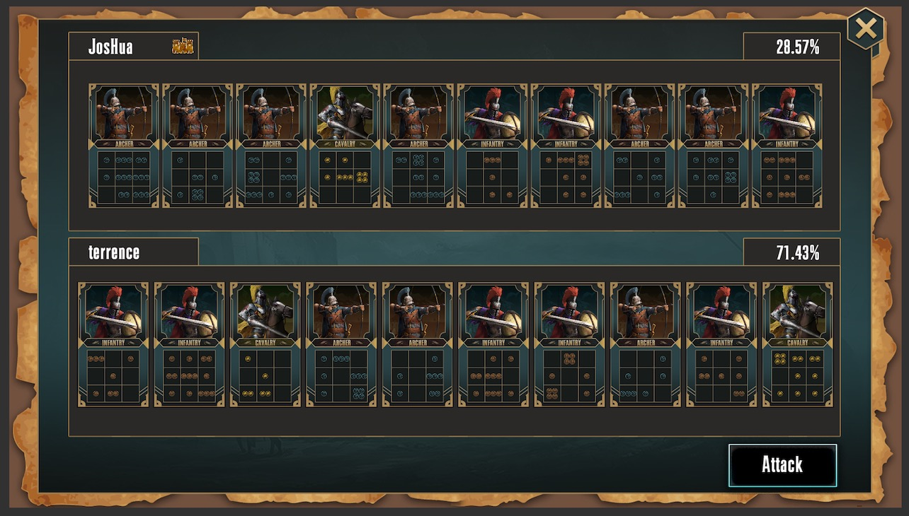
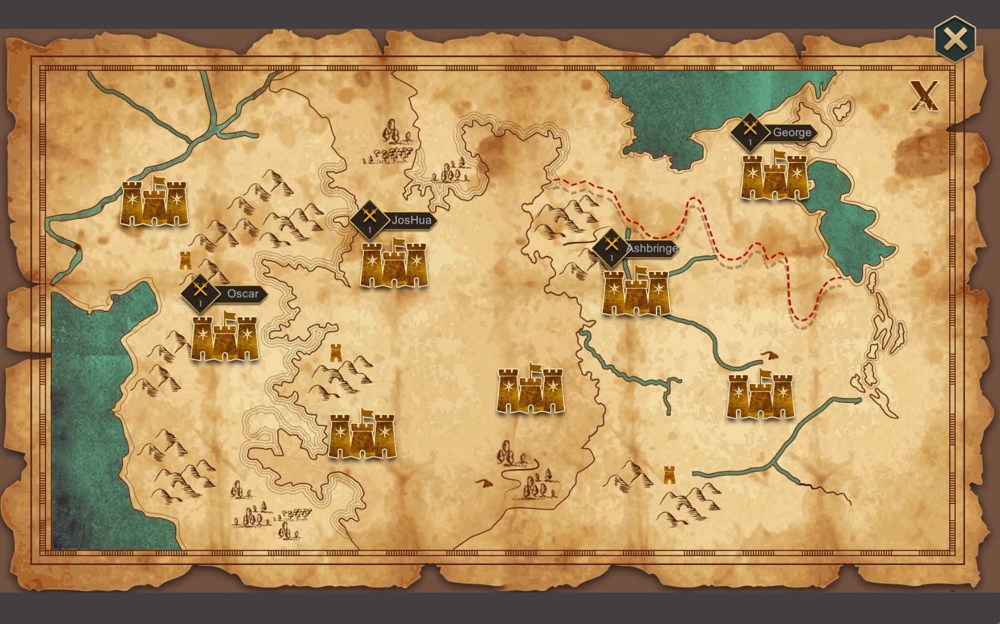

# 《卡莱战纪》体验篇

《卡莱战纪》是一款核心逻辑上链的区块链卡牌游戏。 是第一款在拜占庭共识网络上**模拟拜占庭将军问题**的链游, 同时也是第一款**靠去中心化连载小说推动**的链游。目前版本由norchain.io 基于NEO区块链基础设施研发。

本篇主要讲述《卡莱》的细节设计以满足玩家在游戏中获得的乐趣体验。关于宏观的玩法介绍见[设计篇](https://github.com/norchain/NEOCarryBattle/blob/master/%E5%8D%A1%E8%8E%B1%E6%88%98%E7%BA%AA-%E8%AE%BE%E8%AE%A1.md)， 关于技术实现见[技术篇](https://github.com/norchain/NEOCarryBattle/blob/master/%E5%8D%A1%E8%8E%B1%E6%88%98%E7%BA%AA-%E6%8A%80%E6%9C%AF.md)。

## 1. 核心玩法功能体验

作为全链游戏，在享用区块链技术带来的很多便利和特性的同时也可能会带来对玩家体验的负面效果，其中最主要的是：由于区块生成速度慢，单个玩家无法对“服务器”进行频繁操作。为此我们游戏设计的方案包括如下方面：

### 1.1. 核心体验链交互频次

从核心玩法来讲，玩家大部分操作都是在各个城池里查看和比较信息，或是在决定开战前试验卡牌布局等，真正每场战役对链上的写入操作只有两次（非对称熵算法中的宣称和验证两部分, 见[技术篇](https://github.com/norchain/NEOCarryBattle/blob/master/%E5%8D%A1%E8%8E%B1%E6%88%98%E7%BA%AA-%E6%8A%80%E6%9C%AF.md)2.2）。这些操作的间隔会因各服配置不同以满足不同玩家的娱乐需要，最小的间隔可能是2、3分钟，最长可能是数小时。详见下文c项“软分服配置”。

### 1.2. 玩家本地操作体验

在上节基础上，当玩家终于布置完毕等待战役结果时能做什么呢？《卡莱》里玩家一个重要的收入来源是占城收税。所以玩家在等待期间可以通过点击地图上的城池来非常少比例的影响税收。具体说来，他们可以像挂机游戏一样不停点自己的城池来暂时增加一些税收，也可以不停点别人城池来暂时减缓别人税收。内部的逻辑是：

* 不管玩家点的多快多爽，客户端将隔段时间才统一向链提交一次。
* 这个影响有上限，不管怎么点对战局影响都不会超过1%。如果通过钱包可以用一个call直接按上限值代替最快的手速提交。

**战斗准备** 战前充分准备，以求得最达胜率。

1. 调整卡牌阵型来模拟战争。在进攻之前，可以充分调整自己的出战阵型，保证在不考虑外界因素时，达到胜率的最大化。 真正向区块链写操作只有一件事：用布置好的卡牌阵型加入攻击者或守军向某城进军。
2. 思考其他玩家信息真伪。玩家会通过客户端查询比较各种数据，查看特定玩家之前在攻守同盟时的放鸽子记录，尤其是他声明要帮助你攻城或守城时。
3. 查看玩家即将攻击城市的上次交点记录，以便猜测现在的城主的人气，和潜在的盟友。

**积极性** 玩家某些操作，可以对影响战争积极性，它在战斗中会起到一定的作用，虽然是占比很小的一个因素。可以据此提高玩家的操作性。以下操作可以增加积极性。进而小幅度增加税收。

1. 玩家所占领的城市，随机会出现损坏，如果及时修复。
2. 全地图随时出现一些战争物资，点击捡拾。
3. 全地图随时灾难事件，点击救援。

**战事广播** 服务器内，一场战争的开始和结束。所有玩家都能收到通知，以便去助攻或助防，或者查看这次战斗的结果记录。

**升级**：玩家参与战斗获得的战利和占领城市的税收，可以用来升级卡牌来获得更大的单军作战能力。如果运气好卡牌的兵种、布阵和等级达到特定的组合，会化身为历史英雄（如凯撒牌、刘秀牌等，小说部分有叙述）而获得更多特性加成。

游戏世界还会和去中心化小说相互影响，这点将在下一章介绍。

**链外联盟**：“联盟协作”这件事， 即使官方不设计，也必然会带来玩家各种线下讨论。我们组织了[Discord](https://discordapp.com/invite/pKQyyrP)群供玩家自由讨论与结盟。但离线联盟并无法决定玩家链上游戏行为。因为即使离线联盟相互十分信任攻守一致, 也无法防止同服其他陌生玩家搅局。精明的玩家也可以暗自从Discord讨论中分析战局的信息。

**历史知识及小说阅读**：玩游戏之外还有意外的收获

1. 玩家在等待占城或等待战斗期间可以阅读最新章节的小说。
2. 玩家点击某个城市图标时，有机率看到和这个城市相关的一段历史故事。

### 1.3. 软分服配置

有玩家喜欢玩爽，快速战斗也不求援军。有玩家喜欢长考，深刻分析局势并到链外社区拉拢人头后才开始一战。有的喜欢玩真的拜占庭问题，有的喜欢更直接无法倒戈的传统联盟战争。为尽量满足大多数玩家需求，官方在开新服时需要提供如下表服务器参数：

| 参数名           | 含义                                        | 影响                                                         |
| ---------------- | ------------------------------------------- | ------------------------------------------------------------ |
| is_byzantine     | 是否采用非对称熵方法                        | 如果非，游戏演化为普通组团PvP游戏，逻辑简化成一个阶段，行军完毕就结算。 |
| is_force_notify  | 是否强制在行动阶段广播自己的目标            | (“广播”见技术篇2.2) 如果值为no，玩家行为可能更迷雾           |
| is_cloak_dest    | 是否隐瞒目的地                              | 如果非，那玩家拜占庭问题复杂度不不包括目的地，只包括玩家支持立场 |
| interval_action  | 非对称熵方法中的行动时间长度                | 越长越支持复杂大规模团战。                                   |
| interval_check   | 非对称熵方法中的验证时间长度                | 越长越支持复杂大规模团战。                                   |
| cooldown_nocheck | 对验证阶段不发送check的玩家的惩罚(冷却时间) | 决定该服是否支持玩家乱放烟雾                                 |
| is_novel         | 是否开放小说                                | 如果否，每周期直接推送官方连载。游戏里没有吟游诗人           |

总而言之，最接近模拟真实世界的玩法是提供最小信息确定性的玩法: 在做决定前你有很长时间仔细查阅资料及思考，但是你不知道别人是敌是友，不知道其意图。虽然有一帮人各自宣称自己支持谁，但不到最终一刻谁也不知道谁是真的盟友。所有人有权始终保持沉默，骗了你也不会得到直接惩罚。为了弥补身心怅然，你有一部圣经可读可辩。

{**is_byzantine**:true, **is_force_notify**:false, **is_cloak_dest**: true, **interval_declaim**: long, **interval_check** : long, **cooldown_nocheck**: 0, **is_novel**: true}

最简单直接的玩法是信息确定性最强玩法, 本地试验好阵型后直接开战立刻开打（降维成大掌门那样1v1的传统卡牌对战游戏）：

{**is_byzantine**: false, **is_force_notify**:true, **is_cloak_dest**: false, **interval_declaim**: 0, **interval_check** : ~0, **cooldown_nocheck**: ~0, **is_novel**: false}

在这两种极端之间，可预期有多种合理的配置组合让每个玩家能找到自己的乐趣。

此外，不管分服如何配置，每次战斗总收益上限始终是与interval_action+interval_check 成正比的。因此保证不管在哪个服务器配置情况下玩家在单位时间里不会浮动太大。

## 2. 小说型玩家体验

从战略角度讲，靠去中心化投票的连载小说一方面作为《卡莱》的创新标示和文化担当，另一方面能吸引更多非技术背景网民加深了解区块链技术的媒介。

如上图小说本身结构就很区块链，不同与传统小说的直线式篇章，分布式小说的树状结构代表着由于无法达成共识而形成的分叉，我们只是让玩家的立场代替共识算法去做了确定主链的过程。

从游戏本身而言，去中心化小说也为各服提供更丰富的随机变化并与核心体验相辅相成。

由于分服配置的多样性，可能诞生以下几种与小说相关的玩家/分服类型：

### 2.1

## 常见疑问

**Q: 积极性是全由客户端来控制么，如果这样可信度怎么控制？**

**答**：战争积极度是为了提交玩家在使用官方客户端时的操作体验，所有数据临时在客户端存放。协约选择信任客户端的数据，因为它在战争中所占比例极少，所以不用担心这方面的不同客户端间的不公平性。
