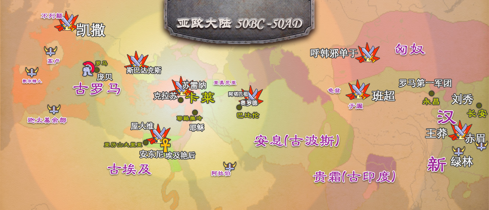

# 《卡莱战纪》小说篇 - 用一部去中心小说检验人性

《卡莱战纪》是一款核心逻辑上链的区块链卡牌游戏。 是第一款在拜占庭共识网络上**模拟拜占庭将军问题**的链游, 同时也是第一款**靠去中心化连载小说推动**的全链游。目前版本由norchain.io 基于NEO区块链基础设施研发。

本篇主要叙述去中心化小说系统的设计，其他内容请参看：

[总介绍](https://github.com/norchain/NEOCarryBattle/blob/master/README.md)

[核心玩法:在拜占庭网络上模拟拜赞庭将军问题](https://github.com/norchain/NEOCarryBattle/blob/master/%E5%8D%A1%E8%8E%B1%E6%88%98%E7%BA%AA-%E6%A0%B8%E5%BF%83%E7%8E%A9%E6%B3%95.md)

[软分服: 大规模链游解决方案](https://github.com/norchain/NEOCarryBattle/blob/master/%E5%8D%A1%E8%8E%B1%E6%88%98%E7%BA%AA-%E5%88%86%E6%9C%8D.md)

[技术: Neunity框架，非对称熵，以及其他](https://github.com/norchain/NEOCarryBattle/blob/master/%E5%8D%A1%E8%8E%B1%E6%88%98%E7%BA%AA-%E6%8A%80%E6%9C%AF.md)

## 1. 概述

去中心化投票的连载小说是《卡莱》设计中不可或缺的一环，与游戏的经济系统和核心体验形成影响闭环。我们希望这个特性去提供给游戏带来更丰富的随机性和时间感体验。也由于其设计的开发和民主性成为一次对人性的试验。(详见本文第4章)

## 2. 功能
小说的投稿和投票都是在各分服独立实现的。基本功能简介如下：

### 2.1 投票流程

官方在链上发布创世序章后, 所有玩家都有资格续写下一章并邀请同服其他玩家为自己投票。一个篇章的发布周期具体流程为：

1. 作者玩家完成章节，通过一个合约函数把作品发表上链，并指明此篇是续在哪篇之后。此篇章称为**参选篇章**，篇章内容大小不超过8千字节。如果这是本周期参与的第一篇，则开始参选期倒计时。

   > 发布结构： {**prevHash**: <上章hash>, **chapID**:<章节号>,  **content**: <文章正文> }

2. 参选期倒计时结束前，其他作者玩家也可以参选。之后进入固定时长的投票期，本服玩家中，只要正占领着某城池超过足够长时间就可以用代币投票。

3. 参与篇章的获投额度必须超过**改写限额**从而成为**候选篇章**。改写限额是由作者试图改写原小说的深度决定的。比如小说主线已经进行到第10章，想要作为第11章的续写所需要的下限额度是很小的，但同样内容如果是想作为第7章的续写(相当于要回溯3章改变主线)，哪所需要的下限额度会大很多。

4. 投票期间包括作者本身每个玩家可以反复投票累积，也可以每次投给不同作者。

5. 投票结束。对每个候选篇章，计算总获投减去改写限额，余额最大的将被发布为**合法续作**。改写限额以及余额的1%将交给官方账号，剩余部分全归被投票作者所有。

6. 合法续作作者将在下次投票结束之前成为本服的“吟游诗人”。发布和“吟游诗人”都会对游戏世界逻辑产生一些影响。具体见2.2。

7. 如果某周期内没有任何候选篇章产生，此轮轮空。等待下一次有作者提交重新进入第1步。

不同与传统小说的直线式篇章，去中心化小说的结构很像区块链本身：树状代表着由于无法达成共识而形成的分叉，《卡莱》尝试让玩家的民主立场而非机器算法去完成共识的过程来确定主链。当进展到较靠后章节时, 如果持异见者开始占上峰希望回到之前某章重写, 那么只要他们争取到足够多投票是允许的, 但是改动越深投票所需的代币越多，所以故事情节会逐渐沉淀. 最后被选出的分支是该服的“真经(Canon)”, 其他的分支成为伪传(Apocrypha).

### 2.2 对世界影响

如上节所述，合法续作的作者获得此周期“吟游诗人”身份。续作发布这件事会对游戏世界造成一个**可预测**的永久性影响。具体说来，续作内容经Hash160的结果20个字节将通过一个可公开查询表格带来世界全局气候、某城市地形、某城市收益、以及诗人本身特殊功能的影响。这个表格部分示例显示如下：

| 字节 | 意义                       | 典型值                                               | 影响     |
| ---- | -------------------------- | ---------------------------------------------------- | -------- |
| 0    | 激活哪些特性               | 0x00...: 没任何特效。0xb0a0...: 仅影响气候和城市税收 |          |
| 1    | 气候                       | 0:多阳, 1:多雨，2:多雾, 3:多冰霜,...                 | 兵种平衡 |
| 2    | 气候极端程度               | 0- 255                                               | 兵种平衡 |
| 3    | 风力                       | 0- 255                                               | 兵种平衡 |
| 5    | 地形变化                   | 0: 平原，1:山地，2:沼泽，...                         | 兵种平衡 |
| 6    | 地形变化城市ID             |                                                      | 兵种平衡 |
| 7    | 城市税收变化(按基准值偏差) | 0-127: 降低程度，128-255：提高程度                   | 收益     |
| 8    | 税收变化城市ID             |                                                      | 收益     |
| 9    | 无城市玩家收益             |                                                      | 收益     |
| 11   | 吟游诗人特种功能           | 0: 参与防守加成, 1: 参与攻击加成, 2: 税收加成, ...   | 吟游诗人 |
| 12   | 吟游诗人特种功能数值       |                                                      | 吟游诗人 |
| ...  | ...                        | ...                                                  | ...      |
|      |                            |                                                      |          |

综上，游戏和小说的关系就变成如上图显示的相互影响、互为促进的逻辑闭环。我们必须强调章节获选后对世界的影响是**可精确预测**的。如此设计的原因将在第4章阐述。

## 3. 小说题材

### 3.1 卡莱战役题材

卡莱战役是改变人类历史20大战役之一, 发生在公元前后的古罗马和古波斯人(安息帝国)之间, 战局结果也直接带来东西文明第一次交锋(罗马第一军团与汉军在甘肃相遇), 前后历史人物可涉及包括凯撒、屋大维、庞贝、斯巴达克斯、克拉苏、光武刘秀、班超、王莽、呼韩邪单于等, 涉及势力有当时世界五大帝国 (走向独裁的罗马共和国、苟延残喘的古埃及、绝境复兴的波斯帝国、萌芽初生的贵霜帝国以及内乱频仍的大汉), 也有趁乱兴起的高卢、凯尔特、匈奴、亚美尼亚、绿林赤眉, 更有惊世美女埃及艳后和王昭君 …… 这段历史有极大的杜撰余地且题材绝不落俗套。

### 3.2 其他题材

各分服小说发展官方不做任何干预，实质也无法干预(因为玩家若愿意会链下自己约定内容编码，用自己的解码器去阅读，在链上看来只是无法解码的字节数组而已)。所以连载题材可以丝毫和卡莱历史无关。

## 4. 小说玩法对人性的审视

去中心化投票小说搭配软分服设置，我们预期会产生一个奇妙的中远期结果。

一方面玩家可以付出一定代价来自由在服务器间流动，另一方面小说的连载在实现艺术性价值的同时会可精确地预测出对游戏世界的利益分配的影响，那么利益相关的玩家对候选作品会做出怎样的反应呢？

我们遇见各个分服可能会逐渐聚集特定性格的玩家，并趋近几种典型的分服风格：分别称为谷、峰、泉、殿、泽：

**沉碌之谷**

谷服玩家游戏的目的是精明地利用一切规则甚至漏洞来最大化代币产出，对小说内容毫无兴趣。他们会倾向避免损失，对真枪实弹地组织对抗也不太感兴趣。谷服里即使有人发布小说也可能没人真心愿花代币投票，久而久之吟游诗人角色可能一直轮空或者按某种默契规律轮转，小说也只是为了平衡利益硬凑的苍白文字。

**权谋之峰**

峰服玩家也普遍不关心小说内容，但他们关心发布篇章对世界的影响以及吟游诗人的特权，峰服作者发布的篇章其实是竞选宣言，而选票其实是拉帮划界。玩家的乐趣在依赖利益交换而获得话语权的争夺中。

**吟游之泉**

泉服一般有个文笔很好被全服拥戴的吟游诗人，他可能不靠身份特权过多影响游戏世界平衡，只是专心打磨续篇，而其他玩家也乐于资助他完成最优秀的作品，哪怕自身利益可能受到新发表的篇章的负面影响。这类分服里容易产生强个人风格的类中心化小说，因而具有较强的艺术性和可读性。吟游诗人必须为自己的篇章内容尽心负责，否则玩家也可能把他投下去。

**圣念之殿**

殿服的小说可能更类似编年史：表述上不具太多文采，但却有严肃的逻辑性发展线，这个特性使得协作写作与上溯改写变得最为可执行且不显违和。服内由于情节发展的争议可能分裂成不同派别，犹如宗教内部的教义（真经）之辩。殿服与峰服不同之处在于，殿服派别间突出的矛盾并非出于争夺权利，而是因为执念心中对小说情节发展方向信仰冲突。

**混沌之泽**

泽服玩家即不像泉、殿那样关心小说内容，也没有谷、峰、殿服一样有强计划性和目标性。他们游戏的目的就是图一爽，所以小说内容可能很混乱。战斗也会相对频繁和随机。

事实上这五种风格既不绝对，也不固定。甚至如历史无数次证明的，十分脆弱和易变。

当平和逸远的吟游之泉闯入实力强大的权谋者，原住民们会为了保护挚爱的诗人和故事线协力一战，让权谋者无法立足城池进行投票，抑或坚持民主的理想信念任其毁掉？

当因信念偏执的圣念者们中出现精明务实的沉碌者，他们的矛盾是否会被暗中利用盘剥，还是会识破阴谋而并肩协作？

自由主义泛滥的泽服是否会被真正的吟游者感动而改变？权谋者的精心布置又是否会被混沌者打破？

......

我们自然会在《卡莱》中找到答案。

> ...
>
> 去，是刺进胸口的波斯弯刀；不去，是处决叛徒的罗马绞架。他该怎么办？
>
> 公元前53年早春，古老的两河平原漫天风雪，峰火遍燃。罗马将军卡尤斯的案上摆着来自第一军团先锋营，第三军团，以及亚美尼亚将军艾西农斯的信函，内容都请求速出兵会战防务空虚的巴比伦城。这千载难逢的好机会连同亚美尼亚人的谄媚文字都没能让卡尤斯得意忘形——戎马三十载的老将此时反而深陷入痛苦与矛盾之中。
>
> 亚美尼亚人自去年秋起就开始行径可疑，如果他们趁此机会倒戈波斯守军，罗马五个精锐营下场只有横尸荒野 —— 道理如此直白，可是卡尤斯却不能拒绝出兵。因为他没法在这糟糕的天气里把拒信送达所有其他营，他甚至无法确定他们已经到了哪里。假如战斗在亚美尼亚人没有叛变情况下因他的缺席蒙受巨大损失，他就成了叛徒…… 在残忍而多疑的执政官克拉苏面前跪下的叛徒。
>
> 去，是扎进胸口的弯刀；不去，是处决叛徒的绞架…… 更可怕的是，他可能只剩几个小时做决策。否则即使决定出发也无法按时赶到巴比伦了。
>
> 该怎么办？嘀嗒、嘀嗒，羊毛毯上晕开一层层水渍，那是死神的沙漏。空气中的碎冰渣拌着大帐里的潮腐气息一同撞进鼻子，隐隐刺痛。东方渐白，厚厚的阴云被大风狂撵着，在冰封的幼发拉底河上飞快的掠过倒影，这无尽旷野里唯一的静动。
>
> ...
>
> "父亲大人，孩儿或有一计....." 一个年轻的声音打破了沉默。
>
>
>
> —— 帕提亚人史 奥特耶洛纪 卷三

## 常见疑问

**欢迎通过[Discord](<https://discord.gg/pKQyyrP> )提交问题，我们将尽快给予回答或讨论，以更好完善游戏设计。**

**Q: 要是小说连载完了该怎么办？**

A: 首先由于GAS限制，我们设定每篇最多8000字符(4千汉字)，分服限制发表间隔(interval_min_novel)的最小值目前是1周。这样一部50万字的小说大概要连载2年多。其次只要分服玩家投票同意，随便什么题材，或者再写续篇都可以，提供足够灵活的社区自由度。

**Q: 不同服务器玩家, 看到的小说是一样的么?**

**答**：小说可以由作家玩家在链外论坛随意开博张贴连载，任何人（包括非玩家）都可以读。但是如果希望被投票上链从而获得代币奖励，该玩家只能在自己所在的分服里提交。也就是说同一篇章只可能成为特定某服的资产。 未来最著名的那部小说，其泉服也会因此荣耀。

**Q: 如果某些服务器玩家对小说不感兴趣，也没人投票怎么办？**

**答**：如本文第四章所述，他们会找到适合自己的地方。

**Q: 小说每章都有字数限制么？**

**答**：考虑到内容的丰富程度，和10Gas免费限制。理想的字数应该在2000~8000字节。