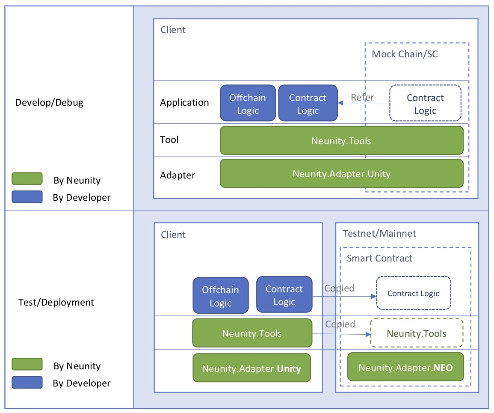

# 《卡莱战纪》技术篇

《卡莱战纪》是一款核心逻辑上链的区块链卡牌游戏。 是第一款在拜占庭共识网络上**模拟拜占庭将军问题**的链游, 同时也是第一款**靠去中心化连载小说推动**的链游。目前版本由norchain.io 基于NEO区块链基础设施研发。技术方面尝试了以下内容并将目前已实现的部分全部开源.


## 引擎层

由于卡莱战纪尝试逻辑上链, 不仅于代币交易, 所以链上逻辑规模相对很大(不是指每次Invoke逻辑都大). 为了能实现大规模逻辑上链的需求, 感谢此次比赛的激励, 我们在研发卡莱战纪的同时研发并开源了一套框架[Neunity](https://github.com/norchain/Neunity).

总体上, Neunity对NEO合约及DAPP的研发体系分**两阶段**和**三层次**(如下图所示)



- 两阶段:**研发**阶段使用嵌入在客户端中的模拟链实现完全脱链完成,无需私链搭建或连接. **测试**阶段
- 三层次: 

1. [已实现] 研发阶段可以在Unity前端内部实现对合约逻辑的**断点调试**及**测试用例**, **无需私链搭建或连接**. 并且可以把合约直接作为前端逻辑一部分,统一研发.教程视频: [Youtube](https://youtu.be/vTkNzx403p8). 

2. [已实现] **自定义序列化方法NuSD**. 可提供自定义的灵活序列化方法(可以类嵌套) ([源码](https://github.com/norchain/Neunity/blob/master/Neunity/Neunity/Tools/NUSerialization.cs)), ([例子](https://github.com/norchain/Neunity/blob/master/Samples/SampleUnity/SmartContract/SmartContract/Scripts/SmartContract/SmartContract.cs)). 我们还制定了NuSD表述规范来统一“前后端”关于某个对象转成字节数组后的结构描述. 

   ```xml
   例子:
   
   1. Card类型的NuSD描述
   <Card> = [S<id>,S<name>,S<birthBlock>,S<level>,S<ownerId>,S<isFighting#1>]
   (<>:字段内容, S:添加前缀, []:并列列表, #n:长度固定为n字节)
       
   2. User类型NuSD描述
   <User> = [S<id>,S[S<Card>*3],[S<warId>*]]
   (*:重复若干次, *m:固定重复m次, S[S<Card>*3]表示嵌入3个加前缀的Card字符数组,然后再加前缀)
       
   ```

   另外, NuSD使用变长前缀算法比官方更省空间(在卡莱里压缩Storage约20%). 注:由于缺少Opcode支持, 目前花费GAS会比较多, 但在优化中.

   

3. [已实现] **仿HTTP标准Response**. 大规模协约代码在协作研发时在通信层的逻辑统一有两个挑战: 

   基于这个实战需求,我们在NuSD基础上研发了仿HTTP协议NuTP(Neunity Transfer Protocol) 从此后前端可以执行标准的: 

   * 由于返回值(或读取Storage)只有Byte[], 前端很不容易判断问题. 

   * 懂NEO的开发者目前还很少, 前端希望有一套对他们相对熟悉的方法来实现逻辑. 

```cs
//前端函数:获取用户完全信息
public void CarryGetUser()
    {
        //... 准备各种参数 ...
    
		// 调用链上函数: 调试阶段就在本地; 测试阶段通过Neo-Lux RPC
        NuTP.Response response = NuContract.InvokeWithResp("<RPC Endpoint>", operation, paras);
		
        if(response.header.code == NuTP.Code.Success){	//仿HTTP错误码
            //从response.body提取内容, 并可以直接复用合约内的逻辑代码(RW.Bytes2User(), RW.Table2Cards()等)
            CarryBattleSC.User user = RW.Bytes2User(NuSD.SplitTbl(response.body,0));
            CarryBattleSC.Card[] cards = RW.Table2Cards(NuSD.SplitTbl(response.body, 1));
            Debug.Log(cards.Length);
        }
        else{
			//异常处理
        }
    }
```


4. [已实现] **URI式Storage管理**. 我们发现NEO的Storage两个特点:

   * 只支持单层Key-Value. StorageMap可以模拟实现两层
   * 当对一个Key写多次相同值时, 每次依然扣除1GAS
   * 当对一个Key写空值时, 效果其实和删除相同, 但相比删除使用0.1GAS,这个操作还是扣1GAS.

   为此我们开发了NuIO对Storage管理进行封装. 实现了类似URI的结构.

   ```cs
   //读操作: key= "server/{sID}/user/{uID}/card/{cID}"
   byte[] cardData = NuIO.GetStorageWithKeyPath("server",sID, "user", uID, "card", cID);
   
   //写操作:cardData为内容, key = "server/{sID}/user/{uID}/card/{cID}
   //此操作在写重复值或空值时只消耗0.1个GAS
   NuIO.SetStorageWithKeyPath(cardData, "server",sID, "user", uID, "card", cID);
   
   
   ```


5. [部分实现] **与Neo-lux无缝衔接**. 目标是前端只需要改一个参数就能在本地调试合约和私链测试间切换.
6. [计划] Neunity下一步计划包括:
   * Tool层(NuIO,NuSD及NuTP所在层) 接入NEL/BlaCat 钱包
   * 和neocomipler.io 协作实现持续集成
   * 研发调试阶段可以任意模拟


## 算法层


### 1. 区块内多随机数生成算法

在区块链上生成多个伪随机数一直是社区热议问题之一。经过与[FabioRick](https://github.com/FabioRick) 与[Jason L Perry](https://medium.com/@ambethia) 的细致讨论与研究，我们公开了两个版本的代码。请参考[这篇文章](https://medium.com/@fabiohcardoso/random-number-at-runtime-neo-smartcontract-60c4e6cb0bb1)

第一个版本利用txid, 实现在同区块内多次invoke获得不同随机值的效果。

第一个版本联合使用txid与blockHash, 相比第一种更具安全性(用户无法猜测blockHash)，但计算上会比较耗GAS。

两种算法可以应用到不同场合里。


### 2. 非对称熵(Asymmentropy)


## 业务层


