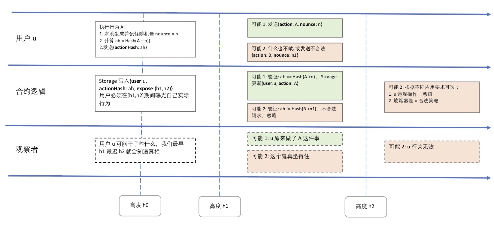
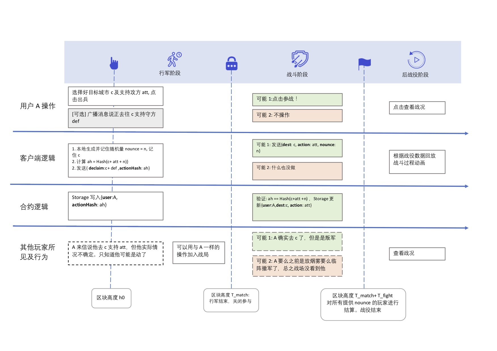

# 《卡莱战纪》技术篇

《卡莱战纪》是一款核心逻辑上链的区块链卡牌游戏。 是第一款在拜占庭共识网络上**模拟拜占庭将军问题**的链游, 同时也是第一款**靠去中心化连载小说推动**的链游。目前版本由norchain.io 基于NEO区块链基础设施研发。技术方面尝试了以下内容并将目前已实现的部分全部开源.


此篇具体讨论技术实现。其他内容请参见：

[总介绍](https://github.com/norchain/NEOCarryBattle/blob/master/README.md)

[核心玩法:在拜占庭网络上模拟拜赞庭将军问题](https://github.com/norchain/NEOCarryBattle/blob/master/%E5%8D%A1%E8%8E%B1%E6%88%98%E7%BA%AA-%E8%AE%BE%E8%AE%A1.md)

[软分服: 大规模链游解决方案](https://github.com/norchain/NEOCarryBattle/blob/master/%E5%8D%A1%E8%8E%B1%E6%88%98%E7%BA%AA-%E5%88%86%E6%9C%8D.md)

[用去中心化小说影响游戏，检验人性](https://github.com/norchain/NEOCarryBattle/blob/master/%E5%8D%A1%E8%8E%B1%E6%88%98%E7%BA%AA-%E5%B0%8F%E8%AF%B4.md)


## 1. 引擎层

由于卡莱战纪尝试逻辑上链, 不仅于代币交易, 所以链上逻辑规模相对很大(不是指每次Invoke逻辑都大). 为了能实现大规模逻辑上链的需求, 感谢此次比赛的激励, 我们在研发卡莱战纪的同时研发并开源了一套框架[Neunity](https://github.com/norchain/Neunity).

总体上, Neunity对NEO合约及DAPP的研发体系分**两阶段**和**三层次**(如下图所示)


- 两阶段:**研发**阶段使用嵌入在客户端中的模拟链实现完全脱链完成,无需私链搭建或连接. **测试**阶段
- 三层次: 

1. [已实现] 研发阶段可以在Unity前端内部实现对合约逻辑的**断点调试**及**测试用例**, **无需私链搭建或连接**. 并且可以把合约直接作为前端逻辑一部分,统一研发.教程视频: [Youtube](https://youtu.be/vTkNzx403p8). 

2. [已实现] **自定义序列化方法NuSD**. 可提供自定义的灵活序列化方法(可以类嵌套) ([源码](https://github.com/norchain/Neunity/blob/master/Neunity/Neunity/Tools/NUSerialization.cs)), ([例子](https://github.com/norchain/Neunity/blob/master/Samples/SampleUnity/SmartContract/SmartContract/Scripts/SmartContract/SmartContract.cs)). 我们还制定了NuSD表述规范来统一“前后端”关于某个对象转成字节数组后的结构描述. 

   ```xml
   例子:
   
   1. Card类型的NuSD描述
   <Card> = [S<id>,S<name>,S<birthBlock>,S<level>,S<ownerId>,S<isFighting#1>]
   (<>:字段内容, S:添加前缀, []:并列列表, #n:长度固定为n字节)
       
   2. User类型NuSD描述
   <User> = [S<id>,S[S<Card>*3],[S<warId>*]]
   (*:重复若干次, *m:固定重复m次, S[S<Card>*3]表示嵌入3个加前缀的Card字符数组,然后再加前缀)
       
   ```

   另外, NuSD使用变长前缀算法比官方更省空间(在卡莱里压缩Storage约20%). 注:由于缺少Opcode支持, 目前花费GAS会比较多, 但在优化中.

   

3. [已实现] **仿HTTP标准Response**. 大规模协约代码在协作研发时在通信层的逻辑统一有两个挑战: 


   * 由于返回值(或读取Storage)只有Byte[], 前端很不容易判断问题. 

   * 懂NEO的开发者目前还很少, 前端希望有一套对他们相对熟悉的方法来实现逻辑. 

   基于这个实战需求,我们在NuSD基础上研发了仿HTTP协议NuTP(Neunity Transfer Protocol) 从此后前端可以执行标准交互并通过Header错误代码管理和调试。例子如下： 

```cs
//前端函数:获取用户完全信息
public void CarryGetUser()
    {
        //... 准备各种参数 ...
    
		// 调用链上函数: 调试阶段就在本地; 测试阶段通过Neo-Lux RPC
        NuTP.Response response = NuContract.InvokeWithResp("<RPC Endpoint>", operation, paras);
		
        if(response.header.code == NuTP.Code.Success){	//仿HTTP错误码
            //从response.body提取内容, 并可以直接复用合约内的逻辑代码(RW.Bytes2User(), RW.Table2Cards()等)
            CarryBattleSC.User user = RW.Bytes2User(NuSD.SplitTbl(response.body,0));
            CarryBattleSC.Card[] cards = RW.Table2Cards(NuSD.SplitTbl(response.body, 1));
            Debug.Log(cards.Length);
        }
        else{
			//异常处理
        }
    }
```


4. [已实现] **URI式Storage管理**. 我们发现NEO的Storage两个特点:

   * 只支持单层Key-Value. StorageMap可以模拟实现两层
   * 当对一个Key写多次相同值时, 每次依然扣除1GAS
   * 当对一个Key写空值时, 效果其实和删除相同, 但相比删除使用0.1GAS,这个操作还是扣1GAS.

   为此我们开发了NuIO对Storage管理进行封装. 实现了类似URI的结构.

   ```cs
   //读操作: key= "server/{sID}/user/{uID}/card/{cID}"
   byte[] cardData = NuIO.GetStorageWithKeyPath("server",sID, "user", uID, "card", cID);
   
   //写操作:cardData为内容, key = "server/{sID}/user/{uID}/card/{cID}
   //此操作在写重复值或空值时只消耗0.1个GAS
   NuIO.SetStorageWithKeyPath(cardData, "server",sID, "user", uID, "card", cID);
   
   
   ```


5. [部分实现] **与Neo-lux无缝衔接**. 目标是前端只需要改一个参数就能在本地调试合约和私链测试间切换.
6. [计划] Neunity下一步计划包括:
   * Tool层(NuIO,NuSD及NuTP所在层) 接入NEL/BlaCat 钱包
   * 和neocomipler.io 协作实现持续集成
   * 研发调试阶段可以任意模拟


## 2. 算法层

### 2.1 区块内多随机数生成算法

在区块链上生成多个伪随机数一直是社区热议问题之一。经过与[FabioRick](https://github.com/FabioRick) 与[Jason L Perry](https://medium.com/@ambethia) 的细致讨论与研究，我们公开了两个版本的代码。请参考[这篇文章](https://medium.com/@fabiohcardoso/random-number-at-runtime-neo-smartcontract-60c4e6cb0bb1)

第一个版本利用txid, 实现在同区块内多次invoke获得不同随机值的效果。

第一个版本联合使用txid与blockHash, 相比第一种更具安全性(用户无法猜测blockHash)，但计算上会比较耗GAS。

两种算法可以使用到不同应用场合里。


### 2.2 非对称熵

#### 2.2.1 非对称熵原理

区块链一大特点是用户所有行为一旦上链就可以被公共查询（除了[zCash](https://z.cash/)和[Monero](http://www.monero.cc/)等以速度为代价实现匿名或隐蔽交易外。LiteCoin也将实现加密签名)，因此在有竞争性质的应用场景（下文称**竞赛**）至少会产生以下三个问题：

1. **后发信息优势**：一次竞赛中越是后参与者越能了解对手信息，造成竞争不公平。
2. **截止期拥堵**：由于1中所述问题，参与者在熟悉规则后永远会倾向于到接近截止期才采取行动。这样势必会带来截止期流量拥堵，也会从而影响用户体验和应用规模。
3. **记账者挑战**：假如竞赛取用某区块哈希值作决定结果的随机因子，而该区块的记账者恰巧以影子帐号参与了竞赛，那么他就有机会合法地筛选或重排交易以达到对自己最好的结果。这个问题对于只有少数[易预测顺序](https://github.com/neo-project/neo/blob/b1cf41d60576e13be772e3b180722f50cd6d64bc/neo/Core/Blockchain.cs#L431)记账节点的公链显得相对[敏感](https://github.com/neo-project/neo-plugins/tree/b7bcde5bb7eccad0aeb8dde1832151eee9911334/SimplePolicy)。

以上三个问题中长期而言在很多资产敏感的场景里对Dapp的打击可能是毁灭性的。

一个在非Confidential公链上的解决思路是**在一段时间内隐蔽用户的真实行为**。那么具体怎么实现呢？

在参加此次比赛期间，[maxpown3r](https://github.com/maxpown3r) 和 [generalkim00](https://github.com/generalkim00) 为设计一款NEO上真正的彩票游戏与[dprat0821](https://github.com/dprat0821)进行讨论，最后提出一个比较完美的解决方案，他俩将此方案命名为Asymmentropy([dprat0821](https://github.com/dprat0821)获授权翻译此方法为“非对称熵”)。

Asymmentropy原理其实并不复杂，它将整个流程分为两个阶段：行动和验证。如下图所示，当用户u在行动阶段提交自己的行动A后，合约只会把A的Hash结果记录下来，因此其他用户只能知道u宣称说他做了一件事而无法得知具体是什么。 此后当区块高度到验证阶段时，u必须再次提交行动A。合约验证此次结果与之前记录的Hash符合，于是把A公布到Storage里。假如在系统规定的验证阶段用户没能提交，那么根据不同应用的不同规则，可以视为用户的合法策略（放烟雾），或视为违规操作进行惩罚。




#### 2.2.2 《卡莱》对非对称熵的应用

卡莱战役的卡牌战斗核心备战与结算过程在不同分服里通过配置复杂度会各有不同（见[分服篇](https://github.com/norchain/NEOCarryBattle/blob/master/%E5%8D%A1%E8%8E%B1%E6%88%98%E7%BA%AA-%E5%88%86%E6%9C%8D.md)。其中一种比较复杂的是模拟拜占庭将军问题(信息的延迟确定)。在这个需求下，我们在非对称熵方法的基础上扩展到如下图所示过程：



虽然图看上去有些复杂，但其实在一场战役中用户的操作只是所示最高一层里的两个操作：进军和参战。当玩家在h0高度开始进军时，所以其他玩家只能知道你似乎“动”了一下，而只有当到区块T_match+T_fight附近时才可能知道其真实行动。

通过这个方法，我们模拟了


### 2.3 [撰写中]


## 3. 业务层

### 3.1 信息补贴

全链PvP游戏一个无法回避的问题是：由于信息公开，一次战争的后参与者始终会因为掌握更多信息而把握更多胜算（传统网游里可以通过服务器暂时隐瞒各玩家输入避免这个问题）。这种情况在某些玩法里甚至可能是摧毁性的。为此我们引入下图所示的信息补贴算法，让风险偏好不同的玩家找到自己的位置。

 


### 3.2 软分服

为应对链游随数据量增大带来的查询成本等问题，我们设计了软分服原则。详细设计及讨论见[软分服]((https://github.com/norchain/NEOCarryBattle/blob/master/%E5%8D%A1%E8%8E%B1%E6%88%98%E7%BA%AA-%E5%88%86%E6%9C%8D.md))。

