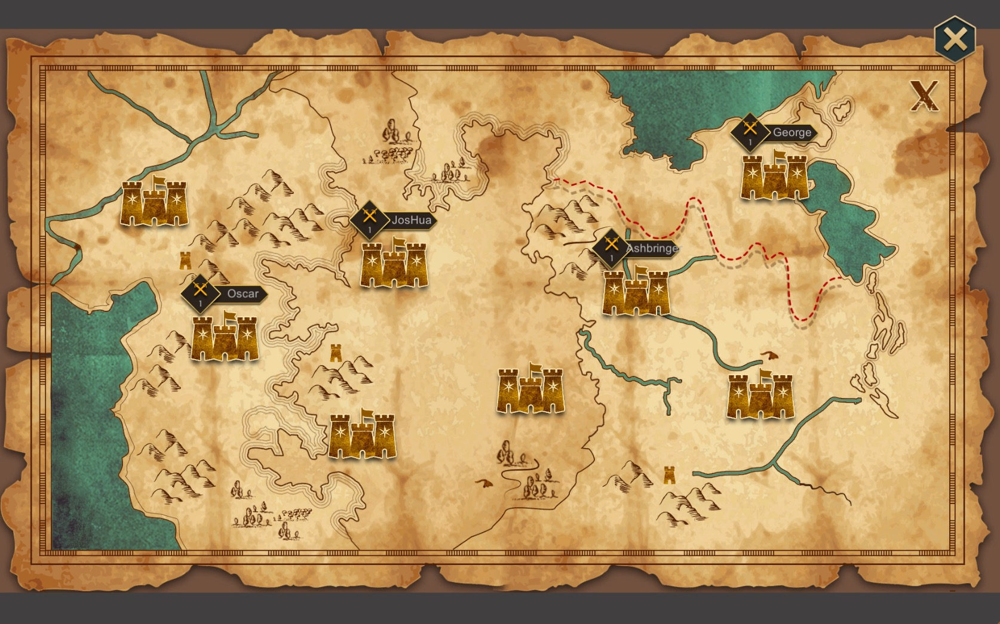
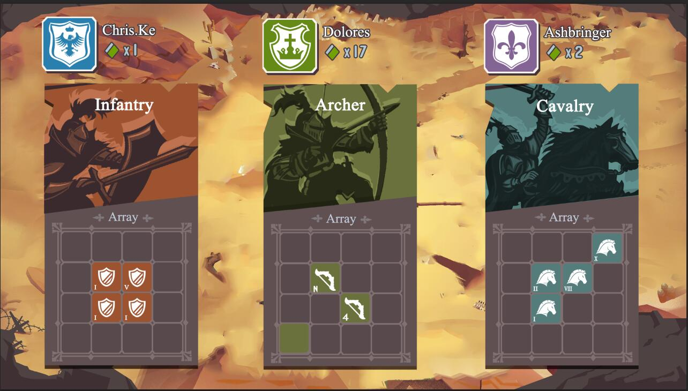
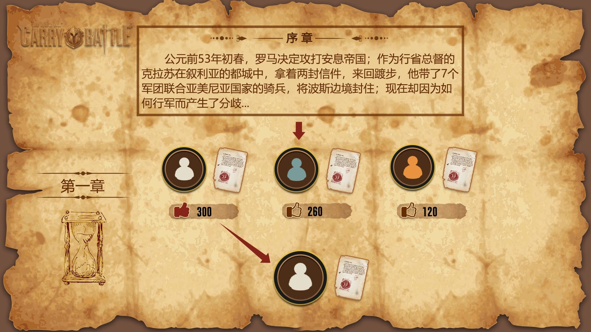
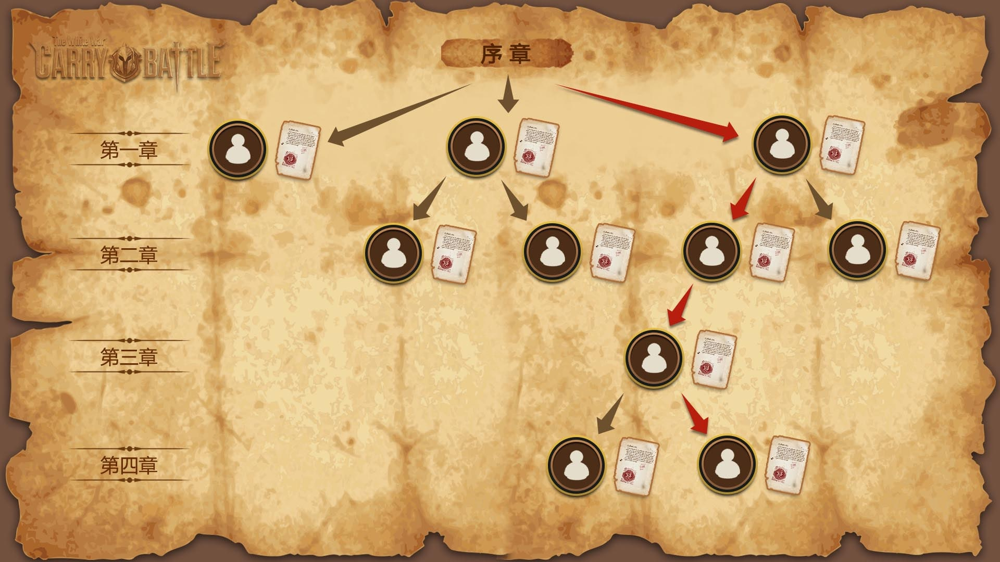
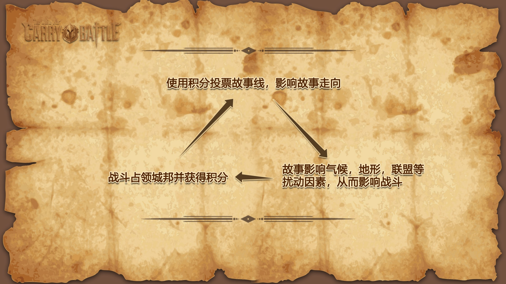
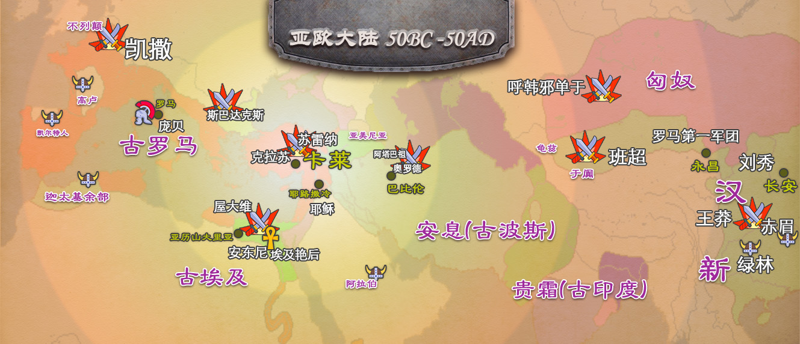
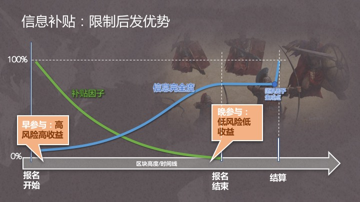
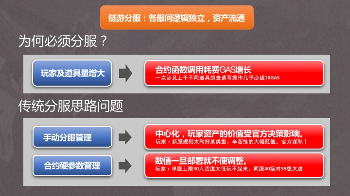

# 《卡莱战纪》玩法篇

《卡莱战纪》是第一款在拜赞庭共识网络上模拟拜占庭将军问题的卡牌链游, 同时也是第一款内置一步能影响游戏世界的去中心化小说的链游。由norchain.io 基于NEO区块链基础设施的开发。

设计制作《卡莱》时, 我们细致考虑了以下方面问题:

1. 如何能在区块链技术尚多限制的情况下尽可能发掘它的特质与潜力.
2. 如何能让一款链游对玩家不仅具有投资价值, 更能具有娱乐价值.

## 基本玩法

玩家注册游戏帐户时拿到随机生成的10张卡牌，每张牌是步、弓、骑其中一种，在3x3格子里排成阵型。

在地图上遍布历史名城，玩家可以去占领一个空城池，也可以去进攻别人的城池。占领城市的领主可以根据占领时长领取分数奖励（税收），每个城市的奖励因子不一样。

玩家(P0) 查看各个城市的守军的卡牌布局后，仔细安排自己的卡牌阵型，然后向守军P1的城市C发起进攻。此时P0进入**行军阶段**。

在*行军阶段*结束前，其他玩家均可以加入战局向目标城市进军。他们都需要宣称自己是支持攻防还是守方, 但实际的立场却并不一定, 但借助区块链技术以及非对称熵加密算法(将在技术篇讨论), 我们可以保正。

当行军阶段结束后，战局进入**攻城阶段**。此时各玩家需公布自己的实际支持派别（这个公布将由算法保障无法和之前决定的支持派别违背）。如果玩家在此阶段未公布，视为中途退出战局，并被惩罚冷却时间。

实际参与到双方的玩家会对攻守各自加成，以一定算法结算后，战利分数由胜方按**信息补贴**(参看*设计特色*)原则分配。

战争结束后，若守方P1战败则退出城市，P0占领该城后开始享有税收。

税收和战争胜利获得的分数可以用来升级玩家卡牌。

## 去中心化小说

### 1. 投票选出的协作小说

所谓去中心化小说, 官方在链上发布首章后, 所有玩家都有资格续写下一章, 但只有被玩家投票最多的才会成为下一段, 成功的作者会获得玩家投票所使用的代币奖励.  

当进展到更靠后章节时, 如果异见者开始冒头希望回到之前某章, 那么只要票数够悬殊是可以的. 所以不同传统小说链状的发展结构, 我们发现去中心化小说会演化为树状. 

### 2. 与游戏内容相互影响促进

如果一个玩家写的章节被选中,他就成为下篇小说发布前游戏里的“吟游诗人”. 我们通过一个算法让这个章节的内容、吟游诗人的行为来一定程度上影响这阶段游戏的平衡. 因此游戏和小说的关系就变成如下这样相互影响、互为促进的关系.

### 3. 宏大的历史背景及不落俗套的题材空间

卡莱战役是改变人类历史20大战役之一, 发生在公元前后的古罗马和古波斯人(安息帝国)之间, 战局结果也直接带来东西文明第一次交锋(罗马第一军团与汉军在甘肃相遇), 前后历史人物可涉及包括凯撒、屋大维、庞贝、斯巴达克斯、克拉苏、光武刘秀、班超、王莽、呼韩邪单于等, 涉及势力有当时世界五大帝国 (走向独裁的罗马共和国、苟延残喘的古埃及、绝地复兴的波斯帝国、萌芽初生的贵霜帝国以及内乱频仍的大汉), 也有趁乱兴起的高卢、凯尔特、匈奴、亚美尼亚、绿林赤眉, 更有惊世美女埃及艳后和王昭君 …… 非常显然, 这段历史有极大的杜撰发挥余地而且绝不落俗套.

另外, 我们的游戏是链上分服游戏(见技术篇: 软分服), 所以每个分服最后都会有自己的故事线. 假如分服对小说并不感兴趣(尽管吟游诗人可以赚钱) 没人发布也没人投票, 那么到时间将会顺着官方版本发展. 让我们看看哪个服务器会投出最精彩的故事!

## 设计特色

除了创新的玩法外，我们还努力在设计细节上避免了仅仅资产上链而带来的价值陷阱，同时针对区块链游戏信息透明及协约调用费用对游戏带来的负面因素提出了**信息补贴**和**软分服**设计方法。

### 1. 全逻辑上链

《卡莱战纪》为全逻辑上链游戏。除了某些图片资源的链接外，玩家无需中心化服务器（本来也没有）甚至无需客户端皆可进行游戏。全逻辑上链（相比仅仅资产上链）的另一个好处是：**玩家资产不仅永远不会丢，而且永远能有用**。

### 2. 全平台移植

iPhone, 安卓与网页， 想玩就玩。卡莱战纪将配备Unity客户端，可无缝移植到iPhone, 安卓与页游。开发团队具有多年研发并运营百万用户级别游戏产品经验，将根据跨平台需求细致打造用户体验。

### 3. 信息补贴

全链PvP游戏一个无法回避的问题是：由于信息公开，一次会战的后参与者始终会因为掌握更多信息而把握更多胜算（传统网游里可以通过服务器暂时隐瞒各玩家输入避免这个问题）。这种情况在某些玩法里甚至可能是摧毁性的。为此我们引入下图所示的信息补贴算法，让风险偏好不同的玩家找到自己的位置。

 

### 4. 软分服

由于NEO区块链单层存储结构，当玩家及道具量增大到一定程度时GAS成本就会急剧上升。比如：对一次涉及上千不同道具或玩家的查读写操作几乎必然超过10GAS。所以在链上分服几乎是必然。然而传统分服方法及各服参数受中心化影响太大会影响玩家资产价值。

我们的解决方案是软分服。如下图所示，在协约里不设置各服人数上限及等级范围的硬值，由玩家自己平衡收益与利弊最后自然形成各服布局。

## 常见疑问

