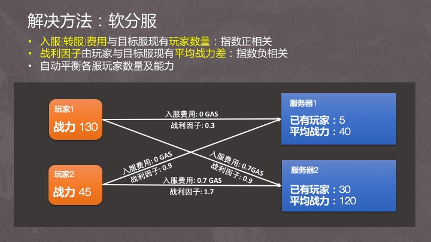

# 《卡莱战纪》玩法篇

《卡莱战纪》是一款核心逻辑上链的区块链卡牌游戏。 是第一款在拜赞庭共识网络上**模拟拜占庭将军问题**的链游, 同时也是第一款**内置靠去中心化投票连载小说驱动游戏**的链游。目前版本由norchain.io 基于NEO区块链基础设施研发。

《卡莱》的设计着重考虑了以下方面问题:

1. 如何能在区块链技术尚有许多限制的情况下尽可能体现其特质，同时探索其潜力？

2. 如何能让一款链游对玩家不仅具有资产投资价值, 更能具有娱乐价值？

   

## I 核心玩法

### 1. 基本流程

玩家注册游戏帐户时拿到随机生成的若干卡牌，每张牌是步、弓、骑其中一种，在3x3格子里排成阵型。

地图上遍布历史名城，玩家可以占领一个空城池，也可以去进攻别人的城池。城市领主根据占领时长领取奖励（税收，可理解为NEO每天生成GAS的过程），每个城市的奖励因子不一样。

玩家随时可以查看各个城市守军信息。当决定要进攻某城市时，仔细安排自己的卡牌阵型以获得最好的战果预期，然后进入**行军阶段**。

在*行军阶段*结束前，其他玩家均可以加入战局向目标城市进军。他们都需要宣称自己是支持攻防还是守方（但实际却并不一定，后文讨论。）

行军阶段结束后，战局进入**攻城阶段**，各玩家按真实立场对战，战利分数由胜方按**信息补贴**(参看*设计特色*)原则分配。

战争结束后，若守方战败则退出城市，战斗的发起者占领该城后开始享有税收。

税收和战利可以用来升级玩家卡牌，也可用来投票决定小说的下一章节。

### 2. 模拟拜占庭难题 

拜占庭将军问题背后的故事是：几个将军想协同攻城，必须有足够人共同参与才能成功。在信息传递不便的古代影响你决策的考虑有三方面：

1. 协同攻城的邀约是否可信？也许只是叛徒诱你出兵攻你老巢，但不到战场无法确知真伪。
2. 是否足够多盟友出兵？如果人数不够就会一败涂地，但这点不到战场你同样无法确知。
3. 假如你因以上顾虑固不出兵或中途撤军，最后可能造成盟友损失而从此失去他们信任。

实现这种游戏方式最核心的挑战是如何**制造玩家真实行动以及这个行动的信息传播时间差**。作为一款逻辑上链游戏，玩家每步操作都在链上接受公共查询，所以这点看似是很难做到的。但是我们最终通过和[maxpown3r](https://github.com/maxpown3r) 及[generalkim00](https://github.com/generalkim00) 的讨论设计了**非对称熵**(Asymmentropy)来实现(他俩用同样的机制实现了一个真正的区块链彩票游戏也[参加了比赛)](https://github.com/generalkim00/neogame)， 非对称熵会在[技术篇](https://github.com/norchain/NEOCarryBattle/blob/master/%E5%8D%A1%E8%8E%B1%E6%88%98%E7%BA%AA-%E6%8A%80%E6%9C%AF.md)会更详细讨论。

总之借助这个机制，玩家的真实行动会通过一段时间才能传递到其他玩家，也可以选择仅仅只放出信息烟雾。他们必须如同古代将军一样在行动前仔细思考上述三个问题，到链上查询信息发布者的历史行为去了解他们的风格。他们可以扮演率领群雄攻城掠地的英雄，闭关捡漏的实用主义者，声名狼藉的两面派或是倒插一刀的冷血内应。

### 3. 玩家操作

**战斗**：因为响应速度的限制，逻辑上链游戏最忌讳玩家与区块链频繁操作。所以《卡莱》中玩家在核心体验里除了通过客户端查询各种数据，反复在本地模拟以及思考其他玩家信息真伪外，真正向区块链写的操作只有一件事：用布置好的卡牌阵容向某城进军去支持攻击者或守军。

**升级**：玩家参与战斗获得的战利和占领城市的税收，可以用来升级卡牌来获得更大的单军作战能力。如果运气好卡牌的兵种、布阵和等级达到特定的组合，会化身为历史英雄（如凯撒、班超等，小说部分有叙述）而获得更多特性加成。

游戏世界还会和一部去中心化小说相互影响，这点将在下一章介绍。

**离链通信**：“联盟协作”这件事， 即使官方不设计，也必然会带来线下讨论。我们组织了Discord群共玩家自由结盟。

## II 去中心化小说

### 1. 投票选出的协作小说

所谓去中心化小说, 官方在链上发布序章后, 所有玩家都有资格续写下一章, 但只有被玩家投票最多的才会成为下一段, 成功的作者会获得玩家投票所使用的代币奖励.  

当进展到更靠后章节时, 如果异见者开始冒头希望回到之前某章, 那么只要票数够悬殊是可以的. 所以不同传统小说链状的发展结构, 我们发现去中心化小说会演化为树状. 

### 2. 与游戏内容相互影响促进

如果一个玩家写的章节被选中,他就成为下篇小说发布前游戏里的“吟游诗人”. 我们通过一个算法让这个章节的内容、吟游诗人的行为来一定程度上影响这阶段游戏的平衡. 因此游戏和小说的关系就变成如下这样相互影响、互为促进的关系.

### 3. 宏大的历史背景及不落俗套的题材空间

卡莱战役是改变人类历史20大战役之一, 发生在公元前后的古罗马和古波斯人(安息帝国)之间, 战局结果也直接带来东西文明第一次交锋(罗马第一军团与汉军在甘肃相遇), 前后历史人物可涉及包括凯撒、屋大维、庞贝、斯巴达克斯、克拉苏、光武刘秀、班超、王莽、呼韩邪单于等, 涉及势力有当时世界五大帝国 (走向独裁的罗马共和国、苟延残喘的古埃及、绝地复兴的波斯帝国、萌芽初生的贵霜帝国以及内乱频仍的大汉), 也有趁乱兴起的高卢、凯尔特、匈奴、亚美尼亚、绿林赤眉, 更有惊世美女埃及艳后和王昭君 …… 非常显然, 这段历史有极大的杜撰发挥余地而且绝不落俗套.

另外, 我们的游戏是链上分服游戏(见技术篇: 软分服), 所以每个分服最后都会有自己的故事线. 假如分服对小说并不感兴趣(尽管吟游诗人可以赚钱) 没人发布也没人投票, 那么到时间将会顺着官方版本发展. 让我们看看哪个服务器会投出最精彩的故事!

## III 链上分服

## IV 其他设计特色

除了创新的玩法外，我们还努力在设计细节上避免了仅仅资产上链而带来的价值陷阱，同时针对区块链游戏信息透明及协约调用费用对游戏带来的负面因素提出了**信息补贴**和**软分服**设计方法。

### 1. 全逻辑上链

《卡莱战纪》为全逻辑上链游戏。除了某些图片资源的链接外，玩家无需中心化服务器（本来也没有）甚至无需客户端皆可进行游戏。全逻辑上链（相比仅仅资产上链）的另一个好处是：**玩家资产不仅永远不会丢，而且永远能有用**。

### 2. 全平台移植

iPhone, 安卓与网页， 想玩就玩。卡莱战纪将配备Unity客户端，可无缝移植到iPhone, 安卓与页游。开发团队具有多年研发并运营百万用户级别游戏产品经验，将根据跨平台需求细致打造用户体验。

### 3. 信息补贴

全链PvP游戏一个无法回避的问题是：由于信息公开，一次会战的后参与者始终会因为掌握更多信息而把握更多胜算（传统网游里可以通过服务器暂时隐瞒各玩家输入避免这个问题）。这种情况在某些玩法里甚至可能是摧毁性的。为此我们引入下图所示的信息补贴算法，让风险偏好不同的玩家找到自己的位置。

 

### 4. 软分服

由于NEO区块链单层存储结构，当玩家及道具量增大到一定程度时GAS成本就会急剧上升。比如：对一次涉及上千不同道具或玩家的查读写操作几乎必然超过10GAS。所以在链上分服几乎是必然。然而传统分服方法及各服参数受中心化影响太大会影响玩家资产价值。

我们的解决方案是软分服。如下图所示，在协约里不设置各服人数上限及等级范围的硬值，由玩家自己平衡收益与利弊最后自然形成各服布局。

## 常见疑问

