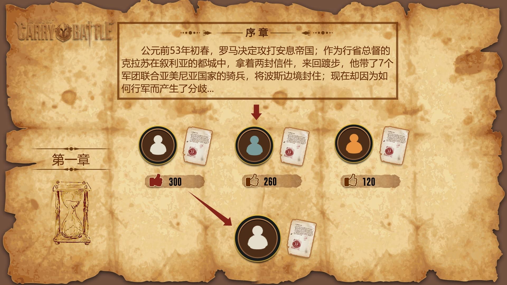
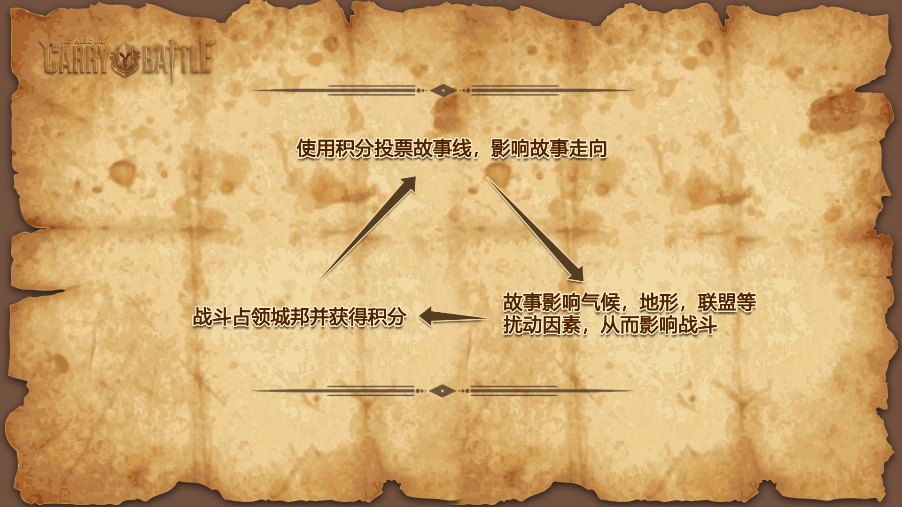

# 《卡莱战纪》玩法篇

《卡莱战纪》是一款核心逻辑上链的区块链卡牌游戏。 是第一款在拜占庭共识网络上**模拟拜占庭将军问题**的链游, 同时也是第一款**靠去中心化连载小说推动**的链游。目前版本由norchain.io 基于NEO区块链基础设施研发。《卡莱》设计时着重考虑了如何能在区块链技术尚有许多限制的情况下尽可能体现其特质，同时探索其潜力。从而使得玩家在游戏获得的不仅是资产投资价值, 更是新鲜有趣的娱乐体验。

## I 核心玩法

### 1. 基本流程

**卡牌设计**：玩家注册游戏帐户时拿到随机生成的若干卡牌，每张牌是步、弓、骑其中一种，在3x3格子里排成阵型。

**占城挖矿**：地图上遍布历史名城，玩家可以占领一个空城池，也可以去进攻别人的城池。城市领主根据占领时长领取奖励，每个城市的奖励因子不一样。

**战役过程**： 玩家随时可以查看各个城市守军信息。当决定要进攻某城市时，仔细安排自己的卡牌阵型以获得最好的战果预期，然后进入**行军阶段**(若干区块)。在行军阶段结束前，其他玩家均可以加入战局向目标城市进军。他们需要宣称自己支持攻防还是守方（但实际却并不一定，后文讨论。）行军阶段结束后，战局进入**攻城阶段**，各玩家按真实立场对战，战利分数由胜方按**信息补贴**(参看*其他设计特色*)原则分配。

**战役结果** 战争结束后，若守方战败则退出城市，战斗的发起者占领该城后开始享有税收。战败者会在一段时间内失去行动能力(冷却), 也可以使用代币快速恢复.

**代币用途**： 税收和战利赢得的代币可以用来升级玩家卡牌，也可用来投票决定该服务器小说的下一章节。

### 2. 模拟拜占庭难题 

拜占庭将军问题背后的故事是：几个将军想协同攻城，必须有足够人共同参与才能成功。在信息传递不便的古代影响你决策的考虑有三方面：

1. 协同攻城的邀约是否可信？也许只是叛徒诱你出兵攻你老巢，但不到战场无法确知真伪。
2. 是否足够多盟友出兵？如果人数不够就会一败涂地，但这点不到战场你同样无法确知。
3. 假如你因以上顾虑固不出兵或中途撤军，最后可能造成盟友损失而从此失去他们信任。

实现这种游戏方式最核心的挑战是如何**制造玩家真实行动和此行动传播到其他玩家的时间差**。作为一款逻辑上链游戏，玩家每步操作都可在链上公共查询，所以这点看似是很难做到的。但是我们最终通过和[maxpown3r](https://github.com/maxpown3r) 及[generalkim00](https://github.com/generalkim00) 的讨论设计了**非对称熵**(Asymmentropy)机制来实现(他俩用同样的机制实现了一个真正的区块链彩票游戏也[参加了比赛](https://github.com/generalkim00/neogame)，非常经典的[合约](https://github.com/generalkim00/neogame/blob/master/SmartContract/NEOLottery/NEOLottery/Class1.cs)值得一读。 非对称熵会在[技术篇](https://github.com/norchain/NEOCarryBattle/blob/master/%E5%8D%A1%E8%8E%B1%E6%88%98%E7%BA%AA-%E6%8A%80%E6%9C%AF.md)更详细讨论。

总之借助这个机制，玩家的真实行动通过一段时间才会传递到其他玩家，也可以选择仅仅只放烟雾。对特定玩家的行为判断当然不是无据可循。作为一款全逻辑上链游戏，所有玩家的参战历史都公开可查，谁是见利忘义的墙头草，谁是最有信誉的坚定战士，谁和谁明显每次都在线下商量好了暗地协作，谁是最狡猾的局势洞察者，都可以通过参考链上数据进行判断和预测。玩家也因此逐渐形成自己的群落，他们可以用自己的实际行动去扮演率领群雄攻城掠地的英雄，闭关捡漏的实用主义者，声名狼藉的两面派，亦或是倒插一刀的冷血内应。逐渐发展出不同的敌友分析及游戏策略来。

### 3. 玩家操作

**战斗**：因为响应速度的限制，逻辑上链游戏忌讳玩家与区块链频繁写操作。所以《卡莱》中玩家在核心体验里， 玩家会通过客户端查询比较各种数据，思考其他玩家信息真伪，也可以反复在本地调整卡牌阵型来模拟战争。真正向区块链写操作只有一件事：用布置好的卡牌阵型加入攻击者或守军向某城进军。

**升级**：玩家参与战斗获得的战利和占领城市的税收，可以用来升级卡牌来获得更大的单军作战能力。如果运气好卡牌的兵种、布阵和等级达到特定的组合，会化身为历史英雄（如凯撒牌、刘秀牌等，小说部分有叙述）而获得更多特性加成。

游戏世界还会和去中心化小说相互影响，这点将在下一章介绍。

**链外联盟**：“联盟协作”这件事， 即使官方不设计，也必然会带来玩家各种线下讨论。我们组织了[Discord](https://discordapp.com/invite/pKQyyrP)群供玩家自由讨论与结盟。但离线联盟并无法决定玩家链上游戏行为。因为即使离线联盟相互十分信任攻守一致, 也无法防止同服其他陌生玩家搅局。精明的玩家也可以暗自从Discord讨论中分析战局的信息。

## II 去中心化小说

### 1. 投票选出下一章节

所谓去中心化小说, 官方在链上发布序章后, 所有玩家都有资格续写下一章, 但在每个服务器里只有被玩家投票最多的才会成为下一段, 成功的作者会获得玩家投票所使用的代币奖励.  

当进展到更靠后章节时, 如果持异见者开始占上峰希望回到之前某章重写, 那么只要他们争取到足够多投票是可以的, 但是改动越深投票所需的代币越多. 所以不同传统小说链状的发展结构, 我们发现去中心化小说会演化为树状, 并且最初的故事情节会逐渐沉淀. 最后被选出的分支是所谓“真经(Canon)”, 其他的分支成为伪传(Apocrypha).

### 2. 新章节内容影响游戏世界逻辑

如果一个玩家写的章节被选中,他就获得下章小说发布前游戏里的“吟游诗人”身份. 我们通过一个算法让这个章节的内容、吟游诗人的行为来影响此阶段游戏的平衡(如:章节文字和诗人行径轨迹通过算法最后使得亚历山大城发生地震由山地变为平原). 因此游戏和小说的关系就变成如下图显示的相互影响、互为促进的关系.

### 3. 宏大的历史背景及新颖题材空间

卡莱战役是改变人类历史20大战役之一, 发生在公元前后的古罗马和古波斯人(安息帝国)之间, 战局结果也直接带来东西文明第一次交锋(罗马第一军团与汉军在甘肃相遇), 前后历史人物可涉及包括凯撒、屋大维、庞贝、斯巴达克斯、克拉苏、光武刘秀、班超、王莽、呼韩邪单于等, 涉及势力有当时世界五大帝国 (走向独裁的罗马共和国、苟延残喘的古埃及、绝境复兴的波斯帝国、萌芽初生的贵霜帝国以及内乱频仍的大汉), 也有趁乱兴起的高卢、凯尔特、匈奴、亚美尼亚、绿林赤眉, 更有惊世美女埃及艳后和王昭君 …… 这段历史有极大的杜撰余地且题材绝不落俗套.

## III 链上分服

### 1. 分服的必要性及挑战

当玩家及道具量增大到一定程度时，调用智能合约时GAS成本很容易超标。比如：对一次涉及上百道具或玩家的查读写操作几乎必然超过10GAS。所以对大规模商业化链游, 链上分服几乎是必由之路。

分服设计的一个基本挑战是链游特有的资产价值敏感性带来的。中心化网游中，运营方可以根据各服玩家具体G点对不同服务器部署不同的配置以及空投不同资源，那是因为两服间资产一般不可相互流通。但链游核心特质之一是数字资产流通性开放，所以如果还一如既往依靠中心化节点分配资源，必然容易打击玩家投资及参与积极性，游戏就很难有持续发展性。

然而如果靠合约硬写入分服参数，万一某项数值不合理或随时间流动玩家兴趣转移，就容易影响全服玩家体验。

### 2. 软分服方案

我们为我们的解决方案起名**软分服**。原则为两条：

1. 运营方可不定时开新服，采用不同配置和内容（比如不同城池部署、不同副本），但一旦开服就不再修改参数。
2. 不限制任何玩家转服，但是针对该玩家与该服平均等级差来影响其收益，并根据该服现有人数多少收取不等入服费用。
3. 一个服务器总人数越多，同样事件奖励越大。

如下图所示，这样的设计会因为玩家自己平衡收益与利弊最后自然形成各服布局。

### 3. 软分服其他好处

软分服带来另一个好处是一个分服就是一个开放社区。服内的大佬会更有驱动力领导优化社区健康发展，否则流失人口后大家收益就越来越少。

## IV 其他设计特色

除了上述最重要的创新的设计外，我们有如下设计细节：

### 1. 全逻辑上链

《卡莱战纪》为全逻辑上链游戏。除了某些图片资源的链接外，玩家无需依赖中心化逻辑服务器（本来也没有）游戏，甚至理论上无需客户端光靠钱包都可进行游戏。全逻辑上链（相比仅仅资产上链）的另一个好处是：**玩家资产不仅永远不会丢，而且永远能有用**。

### 2. 全平台移植

iPhone, 安卓与网页， 想玩就玩。卡莱战纪将配备Unity客户端，可无缝移植到iPhone, 安卓与页游。开发团队具有多年研发并运营百万用户级别游戏产品经验，将根据跨平台需求细致打造用户体验。

### 3. 信息补贴

全链PvP游戏一个无法回避的问题是：由于信息公开，一次战争的后参与者始终会因为掌握更多信息而把握更多胜算（传统网游里可以通过服务器暂时隐瞒各玩家输入避免这个问题）。这种情况在某些玩法里甚至可能是摧毁性的。为此我们引入下图所示的信息补贴算法，让风险偏好不同的玩家找到自己的位置。

 

## 常见疑问

**Q1: 不同服务器玩家, 看到的小说是一样的么?**

小说可以由作家玩家在链外论坛随意开博张贴连载，任何人（包括非玩家）都可以读。但是如果希望被投票上链从而获得代币奖励，该玩家只能在自己所在的分服里提交。也就是说同一篇章只可能成为特定某服的资产。 未来最著名的那部小说，其分服也会因此荣耀。

**Q2: 如果某些服务器玩家对小说不感兴趣，也没人投票怎么办？**

吟游诗人可以赚钱也有短期内影响游戏逻辑的能力，所以一般情况下不会空缺。假如某分服没有小说传统，随便贴些烂文只求拉票也没问题。那样玩家投的就纯是人气。退一万步没人发布也没人投票, 那么一旦到时间将会顺着官方版本发布小说篇章。

**Q3: 哪些数据是服务器隔离的, 我的卡牌可以和其它服玩家进行交易么?**

答: 服务隔离的是一些游戏相关数据, 比如城市占领. 资产数据是全网统一的, 不同服玩家可以进行卡牌的交易.

**Q4: 初期玩家, 一手烂牌如何生存?**

答: 首先,卡牌的克制因素在对战成败中占有很大的权重, 所以尽量去攻打可以克制的玩家所占领的城市. 其次在攻打过程中, 尽量争去好友来做你的盟军. 以多打一, 很容易取胜.

**Q5: 正式可玩的版本什么时候上线？**

答: 游戏还在开发中, 预计2019年第一季度正式上neo主网

**Q6: 不占领城市，想和玩家相互打遭遇战可以么？**

答: 暂无此设计安排.

**Q7: 以后考不考虑增加国战？让我们为自己的国家扩大疆土？**

答: 暂无此设计安排.

**Q8: 小说每章都有字数限制么？**

答: 考虑到内容的丰富程序, 和10Gas免费限制. 理想的字数应该在2000~5000字. 